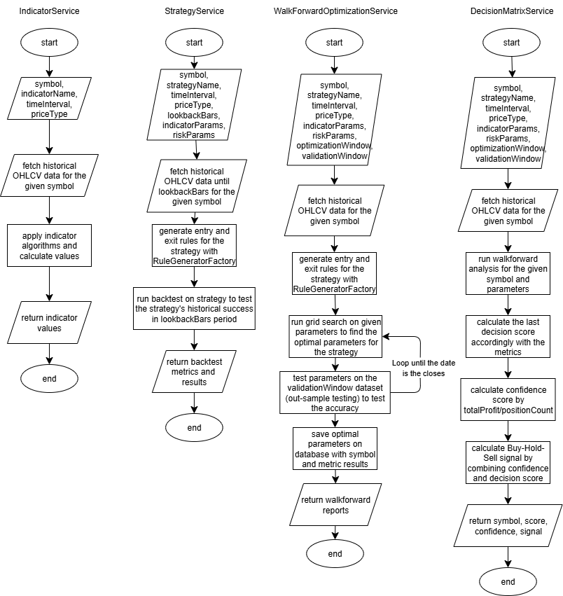

# TradeBot

**TradeBot**, finansal piyasalarda **al-sat sinyalleri üreten ve strateji test eden** çok katmanlı bir platformdur.  
Sistem, farklı teknik indikatörler, istatistiksel analiz yöntemleri ve makine öğrenimi modellerini birleştirerek **karar matrisi tabanlı** işlem sinyalleri üretir.  

## Ne Yapar?

- Gerçek zamanlı piyasa verilerini (OHLCV) çeker (geliştirme daily bazdaki veriler ile yapılmıştır) 
- Belirli teknik indikatörleri (RSI, MACD, MA Cross, Bollinger Bands, Trendlines, DMI, MFI) hesaplar  
- İndikatör skorlarını bir **decision matrix** üzerinden birleştirir  
- **Buy / Sell / Hold / No Trade** sinyali üretir  
- Strateji oluşturup backtest yapar  
- İndikatör performans metriklerini analiz ederek ağırlıkları öğrenir ve günceller
- Risk yönetimi (stop-loss, take-profit, volatilite kontrolü) uygular  

## Teknik Stack

- **Java 21** – Core business logic, Spring Boot servisleri  
- **Spring Boot** – REST API ve workflow yönetimi  
- **PostgreSQL** – Tarihsel & canlı piyasa verisi, sinyal & sonuç kaydı
- **Java ta4j kütüphanesi** - İndikatör logicleri ve sınıflar

### Planda bulunup henüz uygulanmayan

- **Python 3** – AI katmanında kullanılacak olan ML modelleri (değiştirilebilir)  
- **GraalVM (TBD)** – Polyglot entegrasyon
- **Apache Kafka (TBD)** – Streaming pipeline 

## Planlanmış Sistem Katmanları

1. **Teknik Analiz Katmanı**  
   - RSI, MACD, MA Crossover, Bollinger, Trendline, ADX, DMI, MFI indikatör ve strateji implementasyonu

2. **İstatistiksel Analiz Katmanı**  
   - Mean Reversion, Z-score, Pairs Trading, Korelasyon analizi  

3. **AI/ML Katmanı**  
   - LSTM ile fiyat tahmini  
   - Random Forest / XGBoost ile sinyal üretimi  
   - Reinforcement Learning ile geçmiş performanstan öğrenim  

4. **Risk Yönetim Katmanı**  
   - Detaylandırılmış Stop-loss & Take-profit  
   - Volatilite kontrolü ve pozisyon boyutlandırma

### İş Akış Mantığı

Signal Generation → Strategy Backtesting → Decision Matrix Learning

### Data Flow

- **User Strategies** → **Signal Requests** → **Market Data**  
- İndikatör sonuçları + Decision Weights birleşerek **Final Signal** üretir  
- **Outcome Tracker** ile gerçekleşen sonuçlar kaydedilir ve öğrenme sistemine geri beslenir (AI katmanında)

### Teknik Analiz Ana Akış Diyagramı

