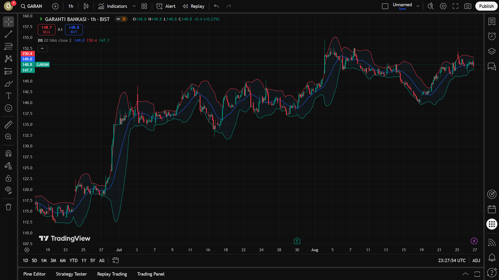

# Teknik Analiz

Finans piyasasında şirketlerin hisselerinin (stock), fonların, dövizlerin ve benzeri diğer menkul kıymetlerin (security) satın alınıp satılmasına karar verebilmek üzere kullanılan birçok çeşit analiz yöntemleri bulunmaktadır. Bunlardan en yaygın bilinenleri

- Temel analiz (fundamental)
- Teknik analiz (technical)

çeşitleridir.

## Finansal Analiz Çeşitleri

### Temel Analiz
Bir şirketin gerçek değerini anlamak için finansal tablolar, endüstri analizleri, ekonomik göstergeler ve diğer çeşitli makroekonomik faktörleri inceleyen bir yöntemdir. [1]

### Teknik Analiz
Fiyat hareketlerini ve işlem hacimlerini inceleyerek gelecekteki piyasa trendlerini tahmin etmeye çalışır. Bu yaklaşım geçmiş piyasa verilerinin gelecekteki fiyat hareketlerini belirlemede yardımcı olabileceği varsayımına dayanır. Teknik analistler, grafikler ve çeşitli göstergeler kullanarak destek ve direnç seviyelerini, trend çizgilerini ve fiyat örüntülerini belirlerler. [1]

Bu raporda bir fiyat grafiği nasıl okunur, nasıl yorumlanır, teknik analiz nedir, teknik analiz aşamasında kullanılan göstergeler (indicators) nelerdir gibi konulardan bahsediyor olacağız. Analiz aracı olarak TradingView.com platformu kullanılacaktır.

### Temel Terminoloji

* **Trade:** Finansal piyasalarsa alım-satım işlemleri yapma işleminin bütününe verilen isimdir.

* **Trading:** Finansal piyasalarsa alım-satım işlemleri yapma işlemine verilen isimdir.

* **Trader:** Finansal piyasalarsa alım-satım işlemleri yapma işlemini yapan kişiye verilen isimdir. Birkaç çeşidi bulunmaktadır: Intraday Trader, Day Trader, Swing Trader. Bu kişilerden rapor içerisinde "borsacı" olarak bahsedilecektir.

    * Intraday Trader: Aynı gün içinde kısa vadeli işlemler yapar, günün sonunda tüm pozisyonlarını kapatır.

    * Day Trader: Günlük fiyat dalgalanmalarından faydalanarak alım-satım yapar, genellikle bir günden uzun pozisyon taşımaz.

    * Swing Trader: Orta vadeli dalgalanmalardan faydalanır, pozisyonlarını birkaç gün ile birkaç hafta arasında tutabilir.

* **Stock:** Hisse

* **Security:** Menkul kıymet

* **Indicator:** Geçmiş fiyat ve hacim verilerini kullanarak piyasanın yönü, momentumu veya gücü hakkında ipuçları veren teknik analiz araçlarıdır. Yatırımcılara alım, satım veya bekleme kararlarında yardımcı olur.

* **Buy/Sell/Hold Signals:** Al/Sat/Tut sinyalleri

* **Bullish:** Piyasanın veya bir varlığın fiyatının yükseleceği beklentisi. Yatırımcıların iyimser olduğu, alım baskısının yüksek olduğu dönemleri tanımlar. Türkçede genellikle “boğa piyasası” olarak geçer.

* **Bearish:** Piyasanın veya bir varlığın fiyatının düşeceği beklentisi. Yatırımcıların kötümser olduğu, satış baskısının yüksek olduğu dönemleri tanımlar. Türkçede genellikle “ayı piyasası” olarak geçer.

## Fiyat Grafiği Okuma

Bu kısımda fiyat grafiklerini okumayı, yorumlamayı ve mum grafiklerinin (candlesticks) anatomisini inceliyor olacağız.


Yukarıdaki fiyat grafiğinde Garanti Bankası'nın (GARAN) günlük bazda 1 yıllık fiyat değişimi'ni gösteren TradingView görseli verilmiştir. [2] Ancak, bir hissenin fiyat grafiğini yorumlamadan önce OHLCV ve Symbol anahtar kelimeleri kesinlikle öğrenilmelidir.

### OHLCV Nedir?

OHLCV, Open High Low Close Volume kelimelerinin kısaltımını temsil etmektedir. Bu kelimeler ise:

* **O**pen: Fiyatın belirlenen zaman aralığındaki **açılış** fiyatını gösterir.
* **H**igh: Fiyatın belirlenen zaman aralığında ulaşmış olduğu **en yüksek** fiyatı gösterir.
* **L**ow: Fiyatın belirlenen zaman aralığında ulaşmış olduğu **en düşük** fiyatı gösterir.
* **C**lose: Fiyatın belirlenen zaman aralığındaki **kapanış** fiyatını gösterir.
* **V**olume: Fiyatın belirlenen zaman aralığındaki **hacmini** gösterir.
* Symbol: Hissenin (veya menkul varlığın) sembolünü gösterir. (Örn. APPLE - AAPL)

Bu kavramlar finans piyasasının bel kemiği görevini görürler ve bir finansal analist veya bir yatırımcı tüm süreçlerinde bu kavramları dahil edeceğinden dolayı bu kavramlara belirli bir seviyede hakim olmalıdır. Raporun ilerleyen kısımlarında bahsedeceğimiz teknik analiz indikatörlerinde bu değerleri sıklıkla kullanacağız. Peki biz bu değerleri nasıl okuruz? Öğrenme sürecimize bir mum grafik anatomisini inceleyerek başlayabiliriz.

## Mum Grafik Anatomisi

Mum grafik, borsada (ingilizcesi ile candlestick olarak da bilinen) bir grafik türüdür. Menkul kıymetler üzerinde gerçekleşen fiyat değişimlerini temsilen kullanılır ve analistler tarafından incelenmek üzere kullanılır. Aslında kullanılan birkaç farklı grafik türünden sadece bir tanesidir, diğerlerine kıyasla daha yaygın kullanılır.

Peki, bir yatırımcı olarak biz mum grafikleri nasıl okuruz? İncelemek üzere aşağıda bir mum grafiğin anatomisi yer almaktadır. [3]


Mum grafikler çoğunlukla fiyat grafiklerinde yeşil ve kırmızı olarak yer alır. Yeşil grafikler bir artışı simgelerken, kırmızı grafikler fiyatta düşüşü simgeler. Bir mum grafiğinin;

* **Open** değeri, **Close** değerinden düşük ise, yani fiyat kapanışa doğru artmışsa, bu bir artış (bullish) grafiğini temsil eder. Yani mum, yeşil renk alır.

* **Close** değeri, **Open** değerinden düşük ise, yani fiyat kapanışa doğru azalmışsa, bu bir azalış (bearish) grafiğini temsil eder. Yani mum, kırmızı renk alır.

Bir mumun açılış noktası, diğer mumun kapanış noktasıdır. Grafikleri analizi yaparken dikkat edilmesi gereken en önemli hususlardan bir diğeri ise zaman aralığı (time interval)'dır.

| "Timing is everything.", *Technical Analysis for Dummies, 2004, Rockefeller B.*

Barbara Rockefeller'ın da dediği gibi, borsada zamanlama her şeydir, tıpkı hayattaki çoğu konuda olduğu gibi. Farklı türde borsacıların kullandığı farklı zaman aralıkları bulunmaktadır. Örneğin, kısa vadeli küçük kazançlar elde etmek isteyen borsacılar (intraday ya da day trader'lar) daha küçük zaman aralıkları kullanarak analiz işlemlerini gerçekleştirirken, uzun vadede getiri elde etmek isteyen borsacılar daha büyük (1 gün, 1 hafta veya 1 ay gibi) zaman aralıkları kullanarak analizlerini gerçekleştirirler.

### Zaman Aralıkları Nasıl Kullanılır?

Araştırma aracımız olan TradingView platformunda yer alan zaman aralıkları 1 saniye ile 12 ay arasında değişmektedir. Biz de bu rapordaki araştırmamızda Alpha Vantage [4] üzerinden aldığımız ücretsiz API anahtarı ile, en yaygın kullanılan zaman aralıklarından biri olan *1 saatlik* veri ile işlem yapıyor olacağız.

| Trader Tipi   | Tercih Edilen Zaman Aralığı       |
|---------------|-----------------------------------|
| **Intraday**  | 1 dk – 15 dk – 1 saat             |
| **Day Trader**| 15 dk – 1 saat – 4 saat           |
| **Swing**     | 4 saat – Günlük                   |
| **Position**  | Haftalık – Aylık                  |

Bu tablo, farklı türde yatırımcıların hangi zaman aralıklarını tercih ettiğini özetlemektedir.


TradingView - GARAN 1 saat bazlı 1 yıllık fiyat değişimi [2]


TradingView - GARAN 1  gün bazlı 1 yıllık fiyat değişimi [2]

Yukarıdaki grafiklerden de anlaşılabildiği üzere kullanılan zaman aralığı grafiğin granülerliğini de büyük ölçüde etkilemektedir. Kullanılan aralık küçüldükçe granülerlik artar ve daha anlık veri akışı sağlanır. Intraday traderlar daha granüler bir fiyat grafiği kullanırlar.

Fiyat grafikleri okuma ve yorumlama yapılmadan bunların öğrenilmesi kritik önem taşımaktadır. Bir sonraki bölümde, öğrendiğimiz OHLCV verilerini kullanarak geleceğe yönelik tahmin yapmamızda yardımcı olacak olan teknik analiz aşamasına geçeceğiz.

## Teknik Analize Giriş

 [7]

Teknik analiz, borsada veya finansal piyasalarda fiyatların geçmişine bakarak gelecekte neler olabileceğini tahmin etmeye çalışan bir yöntemdir. Teknik analiz aynı zamanda piyasa riskini kontrol edebilmeyi de içerir [7].

Aslında bu, günlük hayatta da yaptığımız bir şeye benzer:  
- Havanın son birkaç gündür bulutlu ve rüzgârlı olduğunu görüyorsak, **yarın yağmur yağma ihtimalinin yüksek** olduğunu düşünürüz.  
- Bir mağazanın indirim dönemlerinde fiyatlarını nasıl değiştirdiğini gözlemliyorsak, **gelecek ay yine benzer bir kampanya yapabileceğini tahmin ederiz**.  

Teknik analiz de benzer şekilde, “geçmişte fiyat böyle hareket etmişse, gelecekte de benzer şekilde hareket edebilir” varsayımına dayanır.


Bu görselde teknik analizin en basit yapı taşlarından birisi olan trend çizgileri ile oluşturulan farklı trend çeşitlerini görebiliyoruz. [5]

### Teknik analizde temel amaç nedir?
- Bir hissenin, dövizin veya herhangi bir yatırım aracının yükselme (bullish) ya da düşme (bearish) ihtimalini önceden tahmin edebilmek.  
- Yatırımcıya **“ne zaman almalı, ne zaman satmalı, ne zaman beklemeli”** konusunda yol göstermek.  

### Teknik analiz neye odaklanır?
- Fiyat grafikleri  
- İşlem hacimleri (bir üründen ne kadar alınıp satıldığı)  
- Çeşitli göstergeler (indicators)

Bu veriler sayesinde yatırımcılar, piyasadaki *fırsatları* veya *riskleri* daha kolay görmeye çalışır.  

Kısacası: Temel analiz bir şirketin neden değerli olduğuna bakarken, teknik analiz bu değerin fiyat grafiğine nasıl yansıdığına odaklanır.

## İndikatörler

İndikatörler, geçmiş fiyat ve işlem hacmi verilerini kullanarak piyasadaki trendleri, momentumları ve olası dönüş noktalarını göstermek için kullanılan araçlardır. Yatırımcılar, indikatörleri kullanarak **alım, satım veya bekleme kararları** verir. En yaygın indikatörler arasında Hareketli Ortalamalar, RSI, MACD ve Bollinger Bantları bulunur. Burada bilinmesi gereken en önemli unsurlardan iki tanesi:

* Hiçbir indikatör tek başına güvenilerek kullanılmamalıdır, en az iki veya üç indikatör kombine halde kullanılarak daha sağlıklı tahminler yapılabilir.
* Bu sadece bir araştırma raporudur. Bu raporda yazan hiçbir şey, tamamen araştırma amaçlıdır ve bir uzman tarafından yazılmamış olduğundan ötürü yatırım tavsiyesi niteliğinde değildir.

### 1. Trendlines
Fiyat hareketlerindeki belirgin yükseliş ve düşüşleri göstermek için çizilen düz çizgilerdir. Trendlines, piyasadaki genel yönü (yükselen, düşen veya yatay) hızlıca anlamamızı sağlar. Trend çizgileri seçilen zaman aralığındaki fiyat değişim grafiğindeki mum grafiklerin açılış ve kapanış noktalarına göre çizilir. Aşağıdaki görselde Garanti Bankası'nın 1 saatlik bazda 3 aylık fiyat değişim grafiği yer almaktadır (1h-3M). Bazı örnek trend çizgileri çizilmiştir. 


Teknik analiz sürecinde hiçbir indikatör karar verme konusunda tek başına yeterli görülmemelidir. Trendler teknik analiz konusunda borsanın en önemli bileşenlerinden biridir. Trend çizgileri ise fiyatın gidişatı hakkında fikir sahibi olmamıza yarayacak olan çok önemli bir indikatör tipidir.

Trend çizgileri bazen tek başına çok bir anlam ifade etmese de, bazı grafik formasyonları (patternler), destek ve direnç çizgileri, diğer indikatörleri yorumlama gibi çeşitli konularda yardımcı olmaktadır. Trend çizgilerini yorumlamaya geçmeden önce basit bir trendline hesaplama algoritmasını inceleyelim.  

```pseudo
TrendlineHesaplama

Girdi: FiyatListesi

1. Fiyat grafiğinde yüksek ve düşük noktaları belirle
2. Yükselen trend için düşük noktaları birleştir
3. Düşen trend için yüksek noktaları birleştir
4. Trend çizgisini çiz ve eğimini belirle
5. Trendin yönünü tespit et (yükselen, düşen, yatay)

Çıktı: TrendYönleri

Bitir
```

Yukarıdaki sözde kod ile yazdığımız TrendlineHesaplama algoritmasının ana çıktısı olan TrendYönleri'ni nasıl yorumlarız?

Trend çizgilerimizi oluşturmak için kullandığımız teknikten ve kalıplar kadar, bunları nerede kullanacağımız ve hangi formasyonlar üzerinden yorumlama yapacağımız da önem taşımaktadır. Trend çizgileri envai çeşit alanda kullanılabilir ve çok farklı yorumlama teknikleri bulunabilir.

Grafikler üzerinden trend kalıplarını yorumlamaya başlamak üzere bazı yaygın formasyonları inceleyelim. [6]

 

Yukarıdaki görselde de görüldüğü üzere piyasada bugüne dek gelen bazı kalıplaşmış trendler benzer sonuçlar vermektedir dolayısıyla bu trendler kalıplaştırılarak günümüzdeki yorumlama yöntemlerini de etkilemektedir. Trend kalıpları tek başına bir gösterge olarak kullanılmamalıdır ancak diğer güvenilir indikatör verileriyle desteklenmelidir.

### Trend Kalıpları

Trend kalıpları, fiyatın mevcut yönünün devam edip etmeyeceğini veya tersine dönüp dönmeyeceğini tahmin etmek için kullanılan grafik oluşumlarıdır (formasyonlarıdır). Genellikle iki ana kategoriye ayrılır:

1. Reversal (Geri Dönüş Kalıpları): Mevcut trendin sona erdiğini ve fiyat yönünün tersine dönebileceğini işaret eder. Bazı örnekler:

    * Head and Shoulders (Omuz-Baş-Omuz): Genellikle yükseliş trendinin sonunu işaret eder.

    * Double Top / Double Bottom (Çift Tepe / Çift Dip): Fiyatın belirli bir seviyeyi geçememesiyle trendin zayıfladığını gösterir.

2. Continuation (Devam Kalıpları): Mevcut trendin bir süre konsolide olduktan sonra aynı yönde devam edeceğini gösterir.

    * Flag (Bayrak): Güçlü bir hareket sonrası kısa süreli yatay veya hafif ters yönlü konsolidasyon.

    * Triangle (Üçgen): Fiyat sıkışırken, kırılım sonrası mevcut trend yönünde devam etme eğilimi vardır.

    * Pennant (Flama): Bayrak formasyonuna benzer, daha kısa vadeli küçük bir konsolidasyon formudur.


* Trend kalıplarını kullanırken dikkat edilmesi gerekenler:

    * Kalıp zaman aralığına göre farklı güvenilirlik gösterebilir. Uzun vadeli grafiklerde çıkan formasyonlar genellikle daha güçlü sinyaller üretir.

    * Her zaman hacim (volume) ile desteklenmelidir. Örneğin, bir yükseliş trendinde fiyat yukarı kırıldığında hacmin de artması gerekir.

    * Diğer indikatörlerle birlikte kullanılmalıdır (RSI, MACD, ADX gibi).

### Destek ve Direnç

Destek ve direnç seviyeleri, teknik analizin en temel yapı taşlarından biridir. Fiyat hareketlerinin belirli seviyelerde durma, yön değiştirme veya zorlanma eğilimini ifade eder.

1. **Destek** Nedir?

* Fiyatın aşağı yönlü hareketini durduran veya yavaşlatan seviyedir.

* Yatırımcılar bu seviyeyi “ucuz” olarak görüp alım yapmaya başlar.

* Dolayısıyla talep artar ve fiyatın daha fazla düşmesi engellenir.

    * **Örneğin:** Bir hisse sürekli 100 TL’ye düştüğünde alıcı buluyorsa, 100 TL seviyesi destek kabul edilir.

2. **Direnç** Nedir?

* Fiyatın yukarı yönlü hareketini durduran veya yavaşlatan seviyedir.

* Yatırımcılar bu seviyeyi “pahalı” olarak görüp satış yapmaya başlar.

* Arz arttığı için fiyatın daha fazla yükselmesi zorlaşır.

3. Destek ve Direnç Nasıl Belirlenir?

* Geçmişte fiyatın sık sık dönüş yaptığı noktalar incelenir.

* Grafiklerde trend çizgileri, yatay çizgiler veya hareketli ortalamalar yardımıyla belirlenebilir.

* Hacim (volume) analizi ile birlikte daha güvenilir hale gelir.

Destek ve direnç seviyelerinin önemi, bu seviyelerin kırılması (breakout) yeni trendlerin başlangıcı olabileceğinden dolayı kritiktir. **Alım** kararları genellikle destek bölgelerinde, **Satım** kararları ise direnç bölgelerinde yapılır. Aşağıdaki grafikte örnek bir destek direnç grafiğini inceleyebilirsiniz.


Destek ve direnç seviyelerini hesaplayabilmek için örnek bir algoritma şu şekildedir:

```pseudo
Input: fiyat_verileri

For her fiyat noktasında:
    Eğer fiyat daha önce birçok kez aynı seviyeden yukarı dönmüşse:
        O seviye = DESTEK
    
    Eğer fiyat daha önce birçok kez aynı seviyeden aşağı dönmüşse:
        O seviye = DİRENÇ

Eğer fiyat DESTEK seviyesini aşağı kırarsa:
    Yeni destek seviyesi daha aşağıda aranır

Eğer fiyat DİRENÇ seviyesini yukarı kırarsa:
    Yeni direnç seviyesi daha yukarıda aranır
```

### Trendlerin Temel Özellikleri

Trendleri anlamak için yalnızca çizgiler değil, yön, güç ve kırılma gibi kavramlar da önemlidir. Aşağıda trendlerin temel bileşenleri özetlenmiştir:

1. **Trendin Yönü**
   - **Yükseliş trendi (Uptrend):** Fiyatlar daha yüksek zirveler (higher highs) ve daha yüksek dipler (higher lows) yapar.
   - **Düşüş trendi (Downtrend):** Fiyatlar daha düşük zirveler (lower highs) ve daha düşük dipler (lower lows) yapar.
   - **Yatay trend (Sideways/Range):** Fiyat belli bir bant arasında sıkışır.

2. **Trend Çizgileri**
   - Yükseliş trendinde dipler birleştirilerek çizilir.
   - Düşüş trendinde zirveler birleştirilerek çizilir.
   - Çizgiler fiyatın gelecekte hangi seviyelerde duraksayabileceğini gösterebilir.

3. **Trendin Gücü**
   - **Hacim (volume):** Yüksek hacimde devam eden trend daha güçlüdür.
   - **ADX gibi indikatörler:** Trendin gücünü ölçmek için kullanılabilir.

4. **Trendin Kırılması (Breakout)**
   - Fiyat trend çizgisini aşarsa mevcut trendin sona erdiği düşünülebilir.
   - Çoğu zaman kırılma sonrası yeni bir trend başlar.

5. **“Trend Dosttur” (The Trend is Your Friend)**
   - Yatırımcıların çoğu mevcut trend yönünde işlem yapmayı tercih eder.
   - Trend yönünde yapılan işlemler genellikle daha güvenli kabul edilir.

---

### 2. Hareketli Ortalamalar Kesişimi / MA Crossover
Belirli bir süre boyunca fiyatların ortalamasını alarak trendin yönünü gösterir. Kısa vadeli ve uzun vadeli hareketli ortalamaların kesişimi (crossover) alım veya satım sinyali olarak kullanılabilir.

```pseudo
Başla MA Crossover Hesaplama

Girdi: FiyatlarListesi, KısaMA_Periyot, UzunMA_Periyot

1. Kısa MA = Son KısaMA_Periyot günün ortalama fiyatı
2. Uzun MA = Son UzunMA_Periyot günün ortalama fiyatı
3. Eğer Kısa MA, Uzun MA'yı yukarı keserse: Al sinyali
4. Eğer Kısa MA, Uzun MA'yı aşağı keserse: Sat sinyali
5. Sinyalleri listele ve gün gün takip et

Bitir
```


### 3. RSI (Relative Strength Index)
RSI, Göreceli Güç Endeksi olarak da bilinen, teknik analizde sıkça kullanılan bir momentum osilatör göstergesidir. Bir menkul kıymetin değerinin hızını ve büyüklüğünü güncel fiyat periyodu üzerinden hesaplayarak fiyatın aşırı alım veya aşırı satım seviyelerinde olup olmadığını gösterir.

* J. Welles Wilder Jr. tarafından 1978'de bulunmuştur.

* 0-100 arası değer alır; 70 üzeri **aşırı alım**, 30 altı **aşırı satım** olarak yorumlanır.

    * Aşırı alım durumunda fiyatın tekrar hızlıca dip göreceği tahmin edilir.
    * Aşırı satım durumunda tepki satın alması geleceği tahmin edilir.

```pseudo
Başla RSI Hesaplama

Girdi: FiyatlarListesi, Periyot

1. Günlük Fiyat Değişimi = Bugünkü Fiyat - Önceki Günün Fiyatı
2. Pozitif ve Negatif Değişimleri ayır
3. Ortalama Kazanç = Son 'Periyot' günün pozitif değişimleri ortalaması
4. Ortalama Kayıp = Son 'Periyot' günün negatif değişimleri ortalaması
5. RS = OrtalamaKazanç / OrtalamaKayıp
6. RSI = 100 - (100 / (1 + RS))
7. Günlük RSI değerlerini döndür

Bitir
```


### 4. MACD (Moving Average Convergence Divergence)
Fiyat trendlerinin yönünü ve momentumunu ölçmek için kullanılan bir göstergedir. Farklı hareketli ortalamaların birbirine göre konumu analiz edilir ve al/sat sinyalleri üretilir.

```pseudo
Başla MACD Hesaplama

Girdi: FiyatlarListesi, KısaMA_Periyot, UzunMA_Periyot, Sinyal_Periyot

1. Kısa EMA = Son KısaMA_Periyot günün üstel ortalaması
2. Uzun EMA = Son UzunMA_Periyot günün üstel ortalaması
3. MACD Line = Kısa EMA - Uzun EMA
4. Signal Line = MACD Line'ın Sinyal_Periyot üstel ortalaması
5. Eğer MACD Line, Signal Line'ı yukarı keserse: Al sinyali
6. Eğer MACD Line, Signal Line'ı aşağı keserse: Sat sinyali

Bitir
```


### 5. Bollinger Bands
Fiyatın standart sapmasını dikkate alarak üst ve alt bantlar oluşturur. Fiyatın bantlara yaklaşması, olası bir dönüş veya trend devamının işareti olarak yorumlanabilir.
 
```pseudo
Başla Bollinger Bands Hesaplama

Girdi: FiyatlarListesi, Periyot, StandartSapma

1. Ortalama = Son Periyot günün ortalama fiyatı
2. StandartSapma = Son Periyot günün fiyatlarının standart sapması
3. Üst Bant = Ortalama + (StandartSapma * çarpan)
4. Alt Bant = Ortalama - (StandartSapma * çarpan)
5. Eğer Fiyat Üst Banta yaklaşırsa: Olası geri çekilme
6. Eğer Fiyat Alt Banta yaklaşırsa: Olası yükseliş
7. Bantlar ve fiyat ilişkisini gözlemle

Bitir
```




### 6. ADX (Average Directional Index) ve Directional Moving Index (DMI)
Trendin gücünü ölçen bir göstergedir. ADX değeri yükseldikçe trendin kuvvetli olduğu, düştükçe trendin zayıfladığı anlaşılır. Yönü değil, sadece gücü gösterir.

```pseudo
Başla ADX Hesaplama

Girdi: FiyatlarListesi, Periyot

1. Günlük Yüksek, Düşük ve Kapanış değerlerini al
2. +DI ve -DI hesapla (pozitif ve negatif yön göstergeleri)
3. DX = |(+DI - -DI)| / (+DI + -DI) * 100
4. ADX = DX'nin son Periyot gün ortalaması
5. ADX yüksek ise: Trend güçlü
6. ADX düşük ise: Trend zayıf

Bitir
```


### 6. DMI (Directional Movement Index)
Trendin yönünü ölçen bir göstergedir.

```pseudo
Başla ADX Hesaplama

Girdi: FiyatlarListesi, Periyot


Bitir
```


## Kaynakça

[1] - [Türkiye Finans - Finansal Analiz Türleri](https://www.turkiyefinans.com.tr/tr-tr/blog/sayfalar/finansal-analiz-turleri-nelerdir.aspx)

[2] - [TradingView - 1 Year GARAN Stocks](https://www.tradingview.com/chart/GgCX5Z7V/?symbol=GARAN) 

[3] - [VantageMarkets - 16 Candlestick Charts Traders Need to Know](https://www.vantagemarkets.com/academy/16-candlestick-charts-traders-need-to-know/)

[4] - [AlphaVantage](https://www.alphavantage.co/documentation/)

[5] - [YerliForex - Teknik Analiz](https://yerliforex.com/forex-egitim/teknik-analiz/)

[6] - [Changelly Cheat Sheet](https://changelly.com/blog/chart-patterns-cheat-sheet/)

[7] - Technical Analysis for Dummies, 2004, Rockefeller B