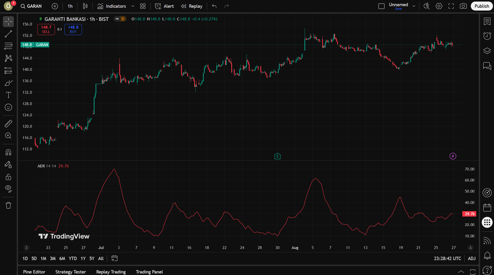

# Teknik Analiz

Finans piyasasında şirketlerin hisselerinin (stock), fonların, dövizlerin ve benzeri diğer menkul kıymetlerin (security) satın alınıp satılmasına karar verebilmek üzere kullanılan birçok çeşit analiz yöntemleri bulunmaktadır. Bunlardan en yaygın bilinenleri

- Temel analiz (fundamental)
- Teknik analiz (technical)

çeşitleridir.

## Finansal Analiz Çeşitleri

### Temel Analiz
Bir şirketin gerçek değerini anlamak için finansal tablolar, endüstri analizleri, ekonomik göstergeler ve diğer çeşitli makroekonomik faktörleri inceleyen bir yöntemdir. [1]

### Teknik Analiz
Fiyat hareketlerini ve işlem hacimlerini inceleyerek gelecekteki piyasa trendlerini tahmin etmeye çalışır. Bu yaklaşım geçmiş piyasa verilerinin gelecekteki fiyat hareketlerini belirlemede yardımcı olabileceği varsayımına dayanır. Teknik analistler, grafikler ve çeşitli göstergeler kullanarak destek ve direnç seviyelerini, trend çizgilerini ve fiyat örüntülerini belirlerler. [1]

Bu raporda bir fiyat grafiği nasıl okunur, nasıl yorumlanır, teknik analiz nedir, teknik analiz aşamasında kullanılan göstergeler (indicators) nelerdir gibi konulardan bahsediyor olacağız. Analiz aracı olarak TradingView.com platformu kullanılacaktır.

### Temel Terminoloji

* **Trade:** Finansal piyasalarsa alım-satım işlemleri yapma işleminin bütününe verilen isimdir.

* **Trading:** Finansal piyasalarsa alım-satım işlemleri yapma işlemine verilen isimdir.

* **Trader:** Finansal piyasalarsa alım-satım işlemleri yapma işlemini yapan kişiye verilen isimdir. Birkaç çeşidi bulunmaktadır: Intraday Trader, Day Trader, Swing Trader. Bu kişilerden rapor içerisinde "borsacı" olarak bahsedilecektir.

    * Intraday Trader: Aynı gün içinde kısa vadeli işlemler yapar, günün sonunda tüm pozisyonlarını kapatır.

    * Day Trader: Günlük fiyat dalgalanmalarından faydalanarak alım-satım yapar, genellikle bir günden uzun pozisyon taşımaz.

    * Swing Trader: Orta vadeli dalgalanmalardan faydalanır, pozisyonlarını birkaç gün ile birkaç hafta arasında tutabilir.

* **Stock:** Hisse

* **Security:** Menkul kıymet

* **Indicator:** Geçmiş fiyat ve hacim verilerini kullanarak piyasanın yönü, momentumu veya gücü hakkında ipuçları veren teknik analiz araçlarıdır. Yatırımcılara alım, satım veya bekleme kararlarında yardımcı olur.

* **Buy/Sell/Hold Signals:** Al/Sat/Tut sinyalleri

* **Bullish:** Piyasanın veya bir varlığın fiyatının yükseleceği beklentisi. Yatırımcıların iyimser olduğu, alım baskısının yüksek olduğu dönemleri tanımlar. Türkçede genellikle “boğa piyasası” olarak geçer.

* **Bearish:** Piyasanın veya bir varlığın fiyatının düşeceği beklentisi. Yatırımcıların kötümser olduğu, satış baskısının yüksek olduğu dönemleri tanımlar. Türkçede genellikle “ayı piyasası” olarak geçer.

## Fiyat Grafiği Okuma

Bu kısımda fiyat grafiklerini okumayı, yorumlamayı ve mum grafiklerinin (candlesticks) anatomisini inceliyor olacağız.


Yukarıdaki fiyat grafiğinde Garanti Bankası'nın (GARAN) günlük bazda 1 yıllık fiyat değişimi'ni gösteren TradingView görseli verilmiştir. [2] Ancak, bir hissenin fiyat grafiğini yorumlamadan önce OHLCV ve Symbol anahtar kelimeleri kesinlikle öğrenilmelidir.

### OHLCV Nedir?

OHLCV, Open High Low Close Volume kelimelerinin kısaltımını temsil etmektedir. Bu kelimeler ise:

* **O**pen: Fiyatın belirlenen zaman aralığındaki **açılış** fiyatını gösterir.
* **H**igh: Fiyatın belirlenen zaman aralığında ulaşmış olduğu **en yüksek** fiyatı gösterir.
* **L**ow: Fiyatın belirlenen zaman aralığında ulaşmış olduğu **en düşük** fiyatı gösterir.
* **C**lose: Fiyatın belirlenen zaman aralığındaki **kapanış** fiyatını gösterir.
* **V**olume: Fiyatın belirlenen zaman aralığındaki **hacmini** gösterir.
* Symbol: Hissenin (veya menkul varlığın) sembolünü gösterir. (Örn. APPLE - AAPL)

Bu kavramlar finans piyasasının bel kemiği görevini görürler ve bir finansal analist veya bir yatırımcı tüm süreçlerinde bu kavramları dahil edeceğinden dolayı bu kavramlara belirli bir seviyede hakim olmalıdır. Raporun ilerleyen kısımlarında bahsedeceğimiz teknik analiz indikatörlerinde bu değerleri sıklıkla kullanacağız. Peki biz bu değerleri nasıl okuruz? Öğrenme sürecimize bir mum grafik anatomisini inceleyerek başlayabiliriz.

## Mum Grafik Anatomisi

Mum grafik, borsada ingilizcesi olan candlestick olarak da bilinen bir grafik türüdür. Menkul kıymetler üzerinde gerçekleşen fiyat değişimlerini temsilen kullanılır ve analistler tarafından incelenmek üzere kullanılır. Peki, bir yatırımcı olarak biz mum grafikleri nasıl okuruz? Aşağıda bir mum grafiğin anatomisi yer almaktadır. [3]


Mum grafikler çoğunlukla fiyat grafiklerinde yeşil ve kırmızı olarak yer alır. Yeşik grafikler bir artışı simgelerken, kırmızı grafikler fiyatta düşüşü simgeler. Bir mum grafiğinin;

* **Open** değeri, **Close** değerinden düşük ise, yani fiyat kapanışa doğru artmışsa, bu bir artış (bullish) grafiğini temsil eder. Yani mum, yeşil renk alır.

* **Close** değeri, **Open** değerinden düşük ise, yani fiyat kapanışa doğru azalmışsa, bu bir azalış (bearish) grafiğini temsil eder. Yani mum, kırmızı renk alır.

Bir mumun açılış noktası, diğer mumun kapanış noktasıdır. Grafikleri analizi yaparken dikkat edilmesi gereken en önemli hususlardan bir diğeri ise zaman aralığı (time interval)'dır.

| "Timing is everything.", *Technical Analysis for Dummies, 2004, Rockefeller B.*

Barbara Rockefeller'ın da dediği gibi, borsada zamanlama her şeydir, tıpkı gerçek hayatta olduğu gibi. Farklı türde borsacıların kullandığı farklı zaman aralıkları bulunmaktadır. Örneğin, kısa vadeli küçük kazançlar elde etmek isteyen borsacılar daha küçük zaman aralıkları kullanarak analiz işlemlerini gerçekleştirirken, uzun vadede getiri elde etmek isteyen borsacılar daha büyük (1 gün, 1 hafta veya 1 ay gibi) zaman aralıkları kullanarak analizlerini gerçekleştirirler.

### Zaman Aralıkları Nasıl Kullanılır?

Araştırma aracımız olan TradingView platformunda yer alan zaman aralıkları 1 saniye ile 12 ay arasında değişmektedir. Biz de bu rapordaki araştırmamızda Alpha Vantage [4] üzerinden aldığımız ücretsiz API anahtarı ile, en yaygın kullanılan zaman aralıklarından biri olan *1 saatlik* veri ile işlem yapıyor olacağız.

| Trader Tipi   | Tercih Edilen Zaman Aralığı       |
|---------------|-----------------------------------|
| **Intraday**  | 1 dk – 15 dk – 1 saat             |
| **Day Trader**| 15 dk – 1 saat – 4 saat           |
| **Swing**     | 4 saat – Günlük                   |
| **Position**  | Haftalık – Aylık                  |

Bu tablo, farklı türde yatırımcıların hangi zaman aralıklarını tercih ettiğini özetlemektedir.


TradingView - GARAN 1 saat bazlı 1 yıllık fiyat değişimi [2]


TradingView - GARAN 1  gün bazlı 1 yıllık fiyat değişimi [2]

Fiyat grafikleri okuma ve yorumlama yapılmadan bunların öğrenilmesi kritik önem taşımaktadır. Bir sonraki bölümde, öğrendiğimiz OHLCV verilerini kullanarak geleceğe yönelik tahmin yapmamızda yardımcı olacak olan teknik analiz aşamasına geçeceğiz.


## Teknik Analize Giriş

Teknik analiz, borsada veya finansal piyasalarda fiyatların geçmişine bakarak gelecekte neler olabileceğini tahmin etmeye çalışan bir yöntemdir.

Aslında bu, günlük hayatta da yaptığımız bir şeye benzer:  
- Havanın son birkaç gündür bulutlu ve rüzgârlı olduğunu görüyorsak, **yarın yağmur yağma ihtimalinin yüksek** olduğunu düşünürüz.  
- Bir mağazanın indirim dönemlerinde fiyatlarını nasıl değiştirdiğini gözlemliyorsak, **gelecek ay yine benzer bir kampanya yapabileceğini tahmin ederiz**.  

Teknik analiz de benzer şekilde, “geçmişte fiyat böyle hareket etmişse, gelecekte de benzer şekilde hareket edebilir” varsayımına dayanır.


Bu görselde teknik analizin en basit yapı taşlarından birisi olan trend çizgileri ile oluşturulan farklı trend çeşitlerini görebiliyoruz. [5]

### Teknik analizde temel amaç nedir?
- Bir hissenin, dövizin veya herhangi bir yatırım aracının yükselme (bullish) ya da düşme (bearish) ihtimalini önceden tahmin edebilmek.  
- Yatırımcıya **“ne zaman almalı, ne zaman satmalı, ne zaman beklemeli”** konusunda yol göstermek.  

### Teknik analiz neye odaklanır?
- Fiyat grafikleri  
- İşlem hacimleri (bir üründen ne kadar alınıp satıldığı)  
- Çeşitli göstergeler (indicators)

Bu veriler sayesinde yatırımcılar, piyasadaki *fırsatları* veya *riskleri* daha kolay görmeye çalışır.  

Kısacası: Temel analiz bir şirketin neden değerli olduğuna bakarken, teknik analiz bu değerin fiyat grafiğine nasıl yansıdığına odaklanır.

## 🔎 İndikatörler

İndikatörler, geçmiş fiyat ve işlem hacmi verilerini kullanarak piyasadaki trendleri, momentumları ve olası dönüş noktalarını göstermek için kullanılan araçlardır. Yatırımcılar, indikatörleri kullanarak **alım, satım veya bekleme kararları** verir. En yaygın indikatörler arasında Hareketli Ortalamalar, RSI, MACD ve Bollinger Bantları bulunur. Burada bilinmesi gereken en önemli unsurlardan iki tanesi:

* Hiçbir indikatör tek başına güvenilerek kullanılmamalıdır, en az iki veya üç indikatör kombine halde kullanılarak daha sağlıklı tahminler yapılabilir.
* Bu sadece bir araştırma raporudur. Bu raporda yazan hiçbir şey, bir uzman tarafından yazılmamış olduğundan ötürü, yatırım tavsiyesi değildir.

### 1. Trendlines
Fiyat hareketlerindeki belirgin yükseliş ve düşüşleri göstermek için çizilen düz çizgilerdir. Trendlines, piyasadaki genel yönü (yükselen, düşen veya yatay) hızlıca anlamamızı sağlar.

```pseudo
Başla Trendline Hesaplama

Girdi: FiyatlarListesi

1. Fiyat grafiğinde yüksek ve düşük noktaları belirle
2. Yükselen trend için düşük noktaları birleştir
3. Düşen trend için yüksek noktaları birleştir
4. Trend çizgisini çiz ve eğimini belirle
5. Trendin yönünü tespit et (yükselen, düşen, yatay)

Bitir
```


### 2. Hareketli Ortalamalar / MA Crossover
Belirli bir süre boyunca fiyatların ortalamasını alarak trendin yönünü gösterir. Kısa vadeli ve uzun vadeli hareketli ortalamaların kesişimi (crossover) alım veya satım sinyali olarak kullanılabilir.

```pseudo
Başla MA Crossover Hesaplama

Girdi: FiyatlarListesi, KısaMA_Periyot, UzunMA_Periyot

1. Kısa MA = Son KısaMA_Periyot günün ortalama fiyatı
2. Uzun MA = Son UzunMA_Periyot günün ortalama fiyatı
3. Eğer Kısa MA, Uzun MA'yı yukarı keserse: Al sinyali
4. Eğer Kısa MA, Uzun MA'yı aşağı keserse: Sat sinyali
5. Sinyalleri listele ve gün gün takip et

Bitir
```


### 3. RSI (Relative Strength Index)
RSI, Göreceli Güç Endeksi olarak da bilinen, teknik analizde sıkça kullanılan bir momentum osilatör göstergesidir. Bir menkul kıymetin değerinin hızını ve büyüklüğünü güncel fiyat periyodu üzerinden hesaplayarak fiyatın aşırı alım veya aşırı satım seviyelerinde olup olmadığını gösterir.

* J. Welles Wilder Jr. tarafından 1978'de bulunmuştur.

* 0-100 arası değer alır; 70 üzeri **aşırı alım**, 30 altı **aşırı satım** olarak yorumlanır.

    * Aşırı alım durumunda fiyatın tekrar hızlıca dip göreceği tahmin edilir.
    * Aşırı satım durumunda tepki satın alması geleceği tahmin edilir.

```pseudo
Başla RSI Hesaplama

Girdi: FiyatlarListesi, Periyot

1. Günlük Fiyat Değişimi = Bugünkü Fiyat - Önceki Günün Fiyatı
2. Pozitif ve Negatif Değişimleri ayır
3. Ortalama Kazanç = Son 'Periyot' günün pozitif değişimleri ortalaması
4. Ortalama Kayıp = Son 'Periyot' günün negatif değişimleri ortalaması
5. RS = OrtalamaKazanç / OrtalamaKayıp
6. RSI = 100 - (100 / (1 + RS))
7. Günlük RSI değerlerini döndür

Bitir
```


### 4. MACD (Moving Average Convergence Divergence)
Fiyat trendlerinin yönünü ve momentumunu ölçmek için kullanılan bir göstergedir. Farklı hareketli ortalamaların birbirine göre konumu analiz edilir ve al/sat sinyalleri üretilir.

```pseudo
Başla MACD Hesaplama

Girdi: FiyatlarListesi, KısaMA_Periyot, UzunMA_Periyot, Sinyal_Periyot

1. Kısa EMA = Son KısaMA_Periyot günün üstel ortalaması
2. Uzun EMA = Son UzunMA_Periyot günün üstel ortalaması
3. MACD Line = Kısa EMA - Uzun EMA
4. Signal Line = MACD Line'ın Sinyal_Periyot üstel ortalaması
5. Eğer MACD Line, Signal Line'ı yukarı keserse: Al sinyali
6. Eğer MACD Line, Signal Line'ı aşağı keserse: Sat sinyali

Bitir
```


### 5. Bollinger Bands
Fiyatın standart sapmasını dikkate alarak üst ve alt bantlar oluşturur. Fiyatın bantlara yaklaşması, olası bir dönüş veya trend devamının işareti olarak yorumlanabilir.

```pseudo
Başla Bollinger Bands Hesaplama

Girdi: FiyatlarListesi, Periyot, StandartSapma

1. Ortalama = Son Periyot günün ortalama fiyatı
2. StandartSapma = Son Periyot günün fiyatlarının standart sapması
3. Üst Bant = Ortalama + (StandartSapma * çarpan)
4. Alt Bant = Ortalama - (StandartSapma * çarpan)
5. Eğer Fiyat Üst Banta yaklaşırsa: Olası geri çekilme
6. Eğer Fiyat Alt Banta yaklaşırsa: Olası yükseliş
7. Bantlar ve fiyat ilişkisini gözlemle

Bitir
```


### 6. ADX (Average Directional Index)
Trendin gücünü ölçen bir göstergedir. ADX değeri yükseldikçe trendin kuvvetli olduğu, düştükçe trendin zayıfladığı anlaşılır. Yönü değil, sadece gücü gösterir.

```pseudo
Başla ADX Hesaplama

Girdi: FiyatlarListesi, Periyot

1. Günlük Yüksek, Düşük ve Kapanış değerlerini al
2. +DI ve -DI hesapla (pozitif ve negatif yön göstergeleri)
3. DX = |(+DI - -DI)| / (+DI + -DI) * 100
4. ADX = DX'nin son Periyot gün ortalaması
5. ADX yüksek ise: Trend güçlü
6. ADX düşük ise: Trend zayıf

Bitir
```




## Kaynakça

[1] - [Türkiye Finans - Finansal Analiz Türleri](https://www.turkiyefinans.com.tr/tr-tr/blog/sayfalar/finansal-analiz-turleri-nelerdir.aspx)

[2] - [TradingView - 1 Year GARAN Stocks](https://www.tradingview.com/chart/GgCX5Z7V/?symbol=GARAN) 

[3] - [VantageMarkets - 16 Candlestick Charts Traders Need to Know](https://www.vantagemarkets.com/academy/16-candlestick-charts-traders-need-to-know/)

[4] - [AlphaVantage](https://www.alphavantage.co/documentation/)

[5] - [YerliForex - Teknik Analiz](https://yerliforex.com/forex-egitim/teknik-analiz/)