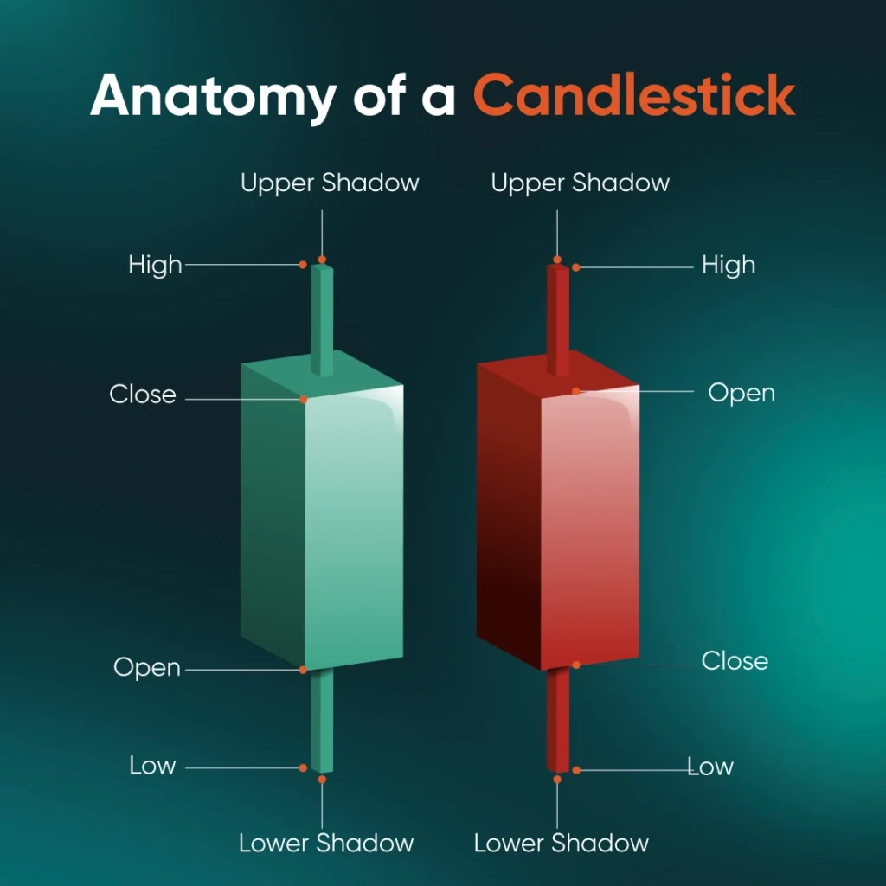
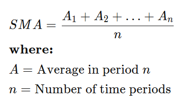
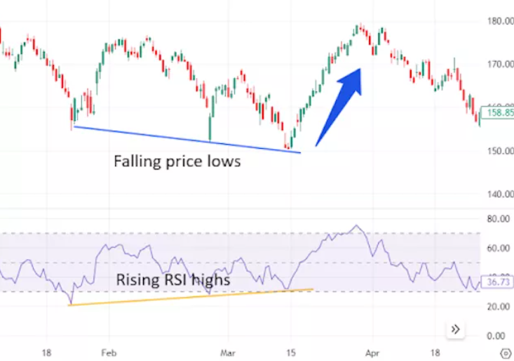

# TradeBot - Teknik Analiz

> Bu rapor, geliştirilmekte olan TradeBot projesinin teknik analiz katmanını özetleyen bir araştırma raporudur. Bu sadece bir araştırma raporu olduğundan ve raporda yazan hiçbir şey bir uzman tarafından yazılmamış olduğundan ötürü yatırım tavsiyesi niteliğinde değildir.

Finans piyasasında şirketlerin hisselerinin (stock), fonların, dövizlerin ve benzeri diğer menkul kıymetlerin (security) satın alınıp satılmasına karar verebilmek üzere kullanılan birçok çeşit analiz yöntemleri bulunmaktadır. Bunlardan en yaygın bilinenleri

- Temel analiz (fundamental)
- Teknik analiz (technical)

çeşitleridir.

## Finansal Analiz Çeşitleri

### Temel Analiz
Bir şirketin gerçek değerini anlamak için finansal tablolar, endüstri analizleri, ekonomik göstergeler ve diğer çeşitli makroekonomik faktörleri inceleyen bir yöntemdir. [1]

### Teknik Analiz
Fiyat hareketlerini ve işlem hacimlerini inceleyerek gelecekteki piyasa trendlerini tahmin etmeye çalışır. Bu yaklaşım geçmiş piyasa verilerinin gelecekteki fiyat hareketlerini belirlemede yardımcı olabileceği varsayımına dayanır. Teknik analistler, grafikler ve çeşitli göstergeler kullanarak destek ve direnç seviyelerini, trend çizgilerini ve fiyat örüntülerini belirlerler. [1]

Bu raporda bir fiyat grafiği nasıl okunur, nasıl yorumlanır, teknik analiz nedir, teknik analiz aşamasında kullanılan göstergeler (indicators) nelerdir gibi konulardan bahsediyor olacağız. Analiz aracı olarak TradingView.com platformunu kullanacağız.

### Temel Terminoloji

* **Trade:** Finansal piyasalarda alım-satım işlemleri yapma işleminin bütününe verilen isimdir.

* **Trading:** Finansal piyasalarda alım-satım işlemleri yapma işlemine verilen isimdir.

* **Trader:** Finansal piyasalarda alım-satım işlemleri yapma işlemini yapan kişiye verilen isimdir. Birkaç çeşidi bulunmaktadır: Intraday Trader, Day Trader, Swing Trader. Bu kişilerden rapor içerisinde "borsacı" olarak bahsedilecektir.

    * Intraday Trader: Aynı gün içinde kısa vadeli işlemler yapar, günün sonunda tüm pozisyonlarını kapatır.

    * Day Trader: Günlük fiyat dalgalanmalarından faydalanarak alım-satım yapar, genellikle bir günden uzun pozisyon taşımaz.

    * Swing Trader: Orta vadeli dalgalanmalardan faydalanır, pozisyonlarını birkaç gün ile birkaç hafta arasında tutabilir.

* **Stock:** Hisse

* **Security:** Menkul kıymet

* **Indicator:** Geçmiş fiyat ve hacim verilerini kullanarak piyasanın yönü, momentumu veya gücü hakkında ipuçları veren teknik analiz araçlarıdır. Yatırımcılara alım, satım veya bekleme kararlarında yardımcı olur.

* **Buy/Sell/Hold Signals:** Al/Sat/Tut sinyalleri, yapılan teknik analiz sonucunda bir hissenin alınıp alınmaması gerektiğine dair gönderilen sinyallere denir.

* **Bullish:** Piyasanın veya bir varlığın fiyatının yükseleceği beklentisi. Yatırımcıların iyimser olduğu, alım baskısının yüksek olduğu dönemleri tanımlar. Türkçede genellikle “boğa piyasası” olarak geçer.

* **Bearish:** Piyasanın veya bir varlığın fiyatının düşeceği beklentisi. Yatırımcıların kötümser olduğu, satış baskısının yüksek olduğu dönemleri tanımlar. Türkçede genellikle “ayı piyasası” olarak geçer.

## Fiyat Grafiği Okuma

Bu kısımda fiyat grafiklerini okumayı, yorumlamayı ve mum grafiklerinin (candlesticks) anatomisini inceliyor olacağız.


Yukarıdaki fiyat grafiğinde Garanti Bankası'nın (GARAN) günlük bazda 1 yıllık (1 Day/1 Year) fiyat değişimi'ni gösteren TradingView görseli verilmiştir. [2] Ancak, bir hissenin fiyat grafiğini yorumlamadan önce OHLCV ve Symbol anahtar kelimeleri kesinlikle öğrenilmelidir.

### OHLCV Nedir?

OHLCV, Open High Low Close Volume kelimelerinin kısaltımını temsil etmektedir. Bu kelimeler ise:

* **O**pen: Fiyatın belirlenen zaman aralığındaki **açılış** fiyatını gösterir.
* **H**igh: Fiyatın belirlenen zaman aralığında ulaşmış olduğu **en yüksek** fiyatı gösterir.
* **L**ow: Fiyatın belirlenen zaman aralığında ulaşmış olduğu **en düşük** fiyatı gösterir.
* **C**lose: Fiyatın belirlenen zaman aralığındaki **kapanış** fiyatını gösterir.
* **V**olume: Fiyatın belirlenen zaman aralığındaki **hacmini** gösterir.
* Symbol: Hissenin (veya menkul varlığın) sembolünü gösterir. (Örn. APPLE - AAPL)

Bu kavramlar finans piyasasının bel kemiği görevini görürler ve bir finansal analist veya bir yatırımcı tüm süreçlerinde bu kavramları dahil edeceğinden dolayı bu kavramlara oldukça hakim olmalıdır. Raporun ilerleyen kısımlarında bahsedeceğimiz teknik analiz indikatörlerinde bu değerleri sıklıkla kullanacağız. Peki biz bu değerleri nasıl okur ve değerlendiririz? Öğrenme sürecimize bir mum grafik anatomisini inceleyerek başlayabiliriz.

## Mum Grafik Anatomisi

Mum grafik, borsada (candlestick olarak da bilinen) bir grafik türüdür. Menkul kıymetler üzerinde gerçekleşen fiyat değişimlerini temsilen kullanılır ve analistler tarafından incelenmek üzere kullanılır. En yaygın kullanılan grafik türlerinden bir tanesidir.

Peki, bir yatırımcı olarak biz mum grafikleri nasıl okuruz? İncelemek üzere aşağıda bir mum grafiğin anatomisi yer almaktadır. [3]



Mum grafikler çoğunlukla fiyat grafiklerinde yeşil ve kırmızı olarak yer alır. Yeşil grafikler bir artışı (bullish) simgelerken , kırmızı grafikler fiyatta düşüşü (bearish) simgeler. Bir mum grafiğinin;

* **Open** değeri, **Close** değerinden düşük ise, yani fiyat kapanışa doğru artmışsa, bu bir artış (bullish) grafiğini temsil eder. Yani mum, yeşil renk alır.

* **Close** değeri, **Open** değerinden düşük ise, yani fiyat kapanışa doğru azalmışsa, bu bir azalış (bearish) grafiğini temsil eder. Yani mum, kırmızı renk alır.

Bir mumun açılış noktası, diğer mumun kapanış noktasıdır.

İkinci en yaygın kullanılan grafik türü olan bar grafikleri inceleyelim.  

## Bar Grafikler

Bar grafikler de fiyat değişimlerini temsil etmek için kullanılan en yaygın grafik türlerinden birisidir. Mantığı mum grafiklerden çok farklı olmamak üzere; en tepe nokta High, en düşük nokta Low değerlerini temsil eder. Barın türüne göre (yani boğa veya ayı grafiğini temsil etmesine göre), eğer yeşilse (artışı temsil ediyorsa) high değerinin altında kalan veya high değeriyle kesişen en üstteki değer kapanış değerini yani **Close**'u, alttaki çizgi ise hissenin o zaman aralığındaki açılış yani **Open** değerini temsil eder. Düşüş temsil eden ayı (bearish) grafiklerinde de tam tersi durum geçerlidir. Close ile Open yer değiştirir, yani menkul o zaman aralığı içerisinde değer kaybetmiştir ve kapanış değeri açılış değerinin altına düşmüştür. Aşağıda bir bar grafiğinin anatomisi yer almaktadır.


Bu raporda mum grafikler kullanılarak ilerlenecektir. Grafiklerin analizi yaparken dikkat edilmesi gereken en önemli hususlardan bir diğeri ise zaman aralığı (time interval)'dır.

| "Timing is everything.", *Technical Analysis for Dummies, 2004, Rockefeller B.*

Barbara Rockefeller'ın da dediği gibi, borsada zamanlama her şeydir, tıpkı hayattaki çoğu konuda olduğu gibi. Farklı türde borsacıların kullandığı farklı zaman aralıkları bulunmaktadır. Örneğin, kısa vadeli küçük kazançlar elde etmek isteyen borsacılar (intraday ya da day trader'lar) daha küçük zaman aralıkları kullanarak analiz işlemlerini gerçekleştirirken, uzun vadede getiri elde etmek isteyen borsacılar daha büyük (1 gün, 1 hafta veya 1 ay gibi) zaman aralıkları kullanarak analizlerini gerçekleştirirler.

| Trader Tipi   | Tercih Edilen Zaman Aralığı       |
|---------------|-----------------------------------|
| **Intraday**  | 1 dk – 15 dk – 1 saat             |
| **Day Trader**| 15 dk – 1 saat – 4 saat           |
| **Swing**     | 4 saat – Günlük                   |
| **Position**  | Haftalık – Aylık                  |

Bu tablo, farklı türde yatırımcıların hangi zaman aralıklarını tercih ettiğini özetlemektedir.

### Zaman Aralıkları Nasıl Kullanılır?

Araştırma aracımız olan TradingView platformunda yer alan zaman aralıkları 1 saniye ile 12 ay arasında değişmektedir. Biz de bu rapordaki araştırmamızda Alpha Vantage [4] üzerinden aldığımız API anahtarı ile zaman aralığı *1 saat* olan veri ile işlem yapıyor olacağız.


TradingView - GARAN 1 saat bazlı 1 yıllık fiyat değişimi [2]


TradingView - GARAN 1 gün bazlı 1 yıllık fiyat değişimi [2]

Yukarıdaki grafiklerden de anlaşılabildiği üzere kullanılan zaman aralığı grafiğin granülerliğini de büyük ölçüde etkilemektedir. Kullanılan aralık küçüldükçe (örn. 1 gün -> 1 saat) granülerlik artar ve daha anlık veri akışı sağlanır. Intraday traderlar daha granüler (zaman aralığı daha küçük) bir fiyat grafiği kullanırlar.

Fiyat grafikleri okuma ve yorumlama yapılmadan bunların öğrenilmesi kritik önem taşımaktadır. Bir sonraki bölümde, öğrendiğimiz OHLCV verilerini kullanarak geçmişe dayalı geleceğe yönelik tahmin yapmamızda yardımcı olacak olan teknik analiz aşamasına geçeceğiz.

## Teknik Analize Giriş

 [7]

Teknik analiz, borsada veya finansal piyasalarda fiyatların geçmişine bakarak gelecekte neler olabileceğini tahmin etmeye çalışan bir yöntemdir. Teknik analiz aynı zamanda piyasa riskini kontrol edebilmeyi de içerir [7].

Aslında bu, günlük hayatta da yaptığımız bir şeye benzer:  
- Havanın son birkaç gündür bulutlu ve rüzgârlı olduğunu görüyorsak, **yarın yağmur yağma ihtimalinin yüksek** olduğunu düşünürüz.  
- Bir mağazanın indirim dönemlerinde fiyatlarını nasıl değiştirdiğini gözlemliyorsak, **gelecek ay yine benzer bir kampanya yapabileceğini tahmin ederiz**.  

Teknik analiz de benzer şekilde, “geçmişte fiyat böyle hareket etmişse, gelecekte de benzer şekilde hareket edebilir” varsayımına dayanır.


Bu görselde teknik analizin en basit yapı taşlarından birisi olan trend çizgileri ile oluşturulan 3 farklı trend çeşidini gözlemliyoruz. [5]

### Teknik analizde temel amaç nedir?
- Bir hissenin, dövizin veya herhangi bir yatırım aracının yükselme (bullish) ya da düşme (bearish) ihtimalini önceden tahmin edebilmek.  
- Yatırımcıya **“ne zaman almalı, ne zaman satmalı, ne zaman beklemeli”** konusunda yol göstermek.  

### Teknik analiz neye odaklanır?
- Fiyat grafikleri (OHLCV verileri)
- İşlem hacimleri (bir üründen ne kadar alınıp satıldığı)  
- Çeşitli göstergeler (indicators)

Bu veriler sayesinde yatırımcılar, piyasadaki *fırsatları* veya *riskleri* daha kolay görmeye çalışır.  

> Kısacası: Temel analiz bir şirketin neden değerli olduğuna bakarken, teknik analiz bu değerin fiyat grafiğine nasıl yansıdığına odaklanır.

## İndikatörler

İndikatörler, geçmiş fiyat ve işlem hacmi verilerini kullanarak piyasadaki trendleri, momentumları ve olası dönüş noktalarını göstermek için kullanılan araçlardır. Yatırımcılar, indikatörleri kullanarak **alım, satım veya bekleme kararları** verir. En yaygın indikatörler arasında Hareketli Ortalamalar, RSI, MACD ve Bollinger Bantları bulunur. Burada bilinmesi gereken en önemli unsur:

> Hiçbir indikatör tek başına güvenilerek kullanılmamalıdır, en az iki indikatör ile kombine halde kullanılarak daha sağlıklı tahminler yapılabilir.

### 1. Trendlines
Fiyat hareketlerindeki belirgin yükseliş ve düşüşleri göstermek için çizilen düz çizgilerdir. Trendlines, piyasadaki genel yönü (yükselen, düşen veya yatay) hızlıca anlamamızı sağlar. Trend çizgileri seçilen zaman aralığındaki fiyat değişim grafiğindeki mum grafiklerin açılış ve kapanış noktalarına göre çizilir. Aşağıdaki görselde Garanti Bankası'nın 1 saatlik bazda 3 aylık fiyat değişim grafiği yer almaktadır (1h-3M). Bazı örnek trend çizgileri çizilmiştir. 


Trendler teknik analiz konusunda borsanın en önemli bileşenlerinden biridir. Trend çizgileri ise fiyatın gidişatı hakkında fikir sahibi olmamıza yarayacak olan çok önemli bir indikatör tipidir.

### Trendlerin Temel Özellikleri

Trendleri anlamak için yalnızca çizgiler değil, yön, güç ve kırılma gibi kavramlar da önemlidir. Aşağıda trendlerin temel bileşenleri özetlenmiştir:

1. **Trendin Yönü**
   - **Yükseliş trendi (Uptrend):** Fiyatlar daha yüksek zirveler (higher highs) ve daha yüksek dipler (higher lows) yapar.
   - **Düşüş trendi (Downtrend):** Fiyatlar daha düşük zirveler (lower highs) ve daha düşük dipler (lower lows) yapar.
   - **Yatay trend (Sideways/Range):** Fiyat belli bir bant arasında sıkışır.

2. **Trend Çizgileri**
   - Yükseliş trendinde dipler birleştirilerek çizilir.
   - Düşüş trendinde zirveler birleştirilerek çizilir.
   - Çizgiler fiyatın gelecekte hangi seviyelerde duraksayabileceğini gösterebilir.

3. **Trendin Gücü**
   - **Hacim (volume):** Yüksek hacimde devam eden trend daha güçlüdür.
   - **ADX gibi indikatörler:** Trendin gücünü ölçmek için kullanılabilir. (Raporun ilerleyen kısımlarında bahsedeceğiz.)

4. **Trendin Kırılması (Breakout)**
   - Fiyat trend çizgisini aşarsa mevcut trendin sona erdiği düşünülebilir.
   - Çoğu zaman kırılma sonrası yeni bir trend başlar.

5. **“Trend Dosttur” (The Trend is Your Friend)**
   - Yatırımcıların çoğu mevcut trend yönünde işlem yapmayı tercih eder.
   - Trend yönünde yapılan işlemler genellikle daha güvenli kabul edilir.

Trend çizgileri çoğu zaman bazen tek başına çok güvenilir bir anlam ifade etmese de, bazı grafik formasyonları (patternler), destek ve direnç çizgileri, diğer indikatörleri yorumlama gibi çeşitli konularda yardımcı olmaktadır. Trend çizgilerini yorumlamaya geçmeden önce basit bir trendline hesaplama algoritmasını inceleyelim.  

```pseudo
TrendlineHesaplama

Girdi: FiyatListesi

1. Fiyat grafiğinde yüksek ve düşük noktaları belirle
2. Yükselen trend için düşük noktaları birleştir
3. Düşen trend için yüksek noktaları birleştir
4. Trend çizgisini çiz ve eğimini belirle
5. Trendin yönünü tespit et (yükselen, düşen, yatay)

Çıktı: TrendYönleri

Bitir
```

Peki, yukarıda sözde kod ile yazdığımız TrendlineHesaplama algoritmasının ana çıktısı olan TrendYönleri'ni nasıl yorumlarız?

Trend çizgilerimizi oluşturmak için kullandığımız teknik ve kalıplar kadar, bunları nerede kullanacağımız ve hangi formasyonlar üzerinden yorumlama yapacağımız da önem taşımaktadır. Trend çizgileri envai çeşit alanda kullanılabilir ve çok farklı yorumlama teknikleri bulunabilir. En basit 3 trend yönü Artış, Azalış ve Sabit kalma trendleridir, ancak bunlarla yetinilmemelidir. Grafikler üzerinden trend kalıplarını yorumlamaya başlamak üzere bazı yaygın formasyonları inceleyelim. [6]

 

Yukarıdaki görselde de görüldüğü üzere piyasada bugüne dek gelen bazı kalıplaşmış trendler benzer sonuçlar vermektedir dolayısıyla bu trendler kalıplaştırılarak günümüzdeki yorumlama yöntemlerini de etkilemektedir. Trend kalıpları tek başına bir gösterge olarak kullanılmamalıdır ancak diğer güvenilir indikatör verileriyle desteklenmelidir.

Ayrıca, grafik formasyonları ezberlenerek fiyat grafiklerinde aranmamalıdır. Borsada teknik analiz yaparak tahmin yapma konusunda gelişmek için bolca örnek yapılmalı ve fiyat grafiği takip araçları kullanılarak eller grafikler üzerinde çizimler yaparak, geçmişe dayalı tahminde bulunarak kirletilmelidir.

### Trend Kalıpları

Trend kalıpları, fiyatın mevcut yönünün devam edip etmeyeceğini veya tersine dönüp dönmeyeceğini tahmin etmek için kullanılan grafik oluşumlarıdır (formasyonlarıdır). Yukarıdaki görselde de görülüyor olabileceği üzere, genellikle iki ana kategoriye ayrılır:

1. **Reversal (Geri Dönüş Kalıpları):** Mevcut trendin sona erdiğini ve fiyat yönünün tersine dönebileceğini işaret eder. Bazı örnekler:

    * **Head and Shoulders (Omuz-Baş-Omuz):** Genellikle yükseliş trendinin sonunu işaret eder.

    * **Double Top / Double Bottom (Çift Tepe / Çift Dip):** Fiyatın belirli bir seviyeyi geçememesiyle trendin zayıfladığını gösterir.

2. **Continuation (Devam Kalıpları):** Mevcut trendin bir süre konsolide olduktan sonra aynı yönde devam edeceğini gösterir.

    * **Flag (Bayrak):** Güçlü bir hareket sonrası kısa süreli yatay veya hafif ters yönlü konsolidasyon.

    * **Triangle (Üçgen):** Fiyat sıkışırken, kırılım sonrası mevcut trend yönünde devam etme eğilimi vardır.

    * **Pennant (Flama):** Bayrak formasyonuna benzer, daha kısa vadeli küçük bir konsolidasyon formudur.

* Trend kalıplarını kullanırken dikkat edilmesi gerekenler:

    * Kalıp zaman aralığına göre farklı güvenilirlik gösterebilir. **Uzun vadeli grafiklerde çıkan formasyonlar genellikle daha güçlü sinyaller üretir.**

    * Her zaman hacim (volume) ile desteklenmelidir. Örneğin, bir yükseliş trendinde fiyat yukarı kırıldığında hacmin de artması gerekir.

    * Diğer indikatörlerle birlikte kullanılmalıdır (RSI, MACD, ADX gibi).

### Destek ve Direnç

Destek ve direnç seviyeleri, teknik analizin en temel yapı taşlarından biridir. Fiyat hareketlerinin belirli seviyelerde durma, yön değiştirme veya zorlanma eğilimini ifade eder.


1. **Destek** Nedir? (Support)

Fiyatın aşağı yönlü hareketini durduran veya yavaşlatan seviyedir. Genellikle birden fazla kapanış değerinin kestiği kırılma noktalarını teğet geçen bir trend çizgisi ile sembolize edilir. Yatırımcılar bu seviyeyi “ucuz” olarak görüp alım yapmaya başlar. Dolayısıyla talep artar ve fiyatın daha fazla düşmesi engellenir.

    Örneğin: Bir hisse sürekli 100 TL’ye düştüğünde alıcı buluyorsa, 100 TL seviyesi destek kabul edilir.

2. **Direnç** Nedir? (Resistance)

Fiyatın yukarı yönlü hareketini durduran veya yavaşlatan seviyedir. Birden fazla açılış değerinin kestiği kırılma noktalarını teğet geçen bir trend çizgisi ile sembolize edilir. Yatırımcılar bu seviyeyi “pahalı” olarak görüp satış yapmaya başlar. Arz arttığı için fiyatın daha fazla yükselmesi zorlaşır, bu nedenle direnç olarak bilinir.

3. **Destek ve Direnç** Nasıl Belirlenir?

    * Geçmişte fiyatın sık sık dönüş yaptığı noktalar incelenir.

    * Grafiklerde trend çizgileri, yatay çizgiler veya hareketli ortalamalar yardımıyla belirlenebilir.

    * Hacim (volume) analizi ile birlikte daha güvenilir hale gelir.

Destek ve direnç seviyelerinin önemi, bu seviyelerin kırılması (breakout) yeni trendlerin başlangıcı olabileceğinden dolayı kritiktir. **Alım** kararları genellikle destek bölgelerinde, **Satım** kararları ise direnç bölgelerinde yapılır. Destek ve direnç seviyelerini hesaplayabilmek için örnek bir algoritma şu şekildedir:

```pseudo
Destek Direnç Hesaplama

Başla

Girdi: FiyatlarListesi

For her fiyat noktasında:
    Eğer fiyat daha önce birden çok kez aynı seviyeden yukarı dönmüşse:
        O seviye = DESTEK
    
    Eğer fiyat daha önce birden çok kez aynı seviyeden aşağı dönmüşse:
        O seviye = DİRENÇ

Eğer fiyat DESTEK seviyesini aşağı kırarsa:
    Yeni destek seviyesi daha aşağıda aranır

Eğer fiyat DİRENÇ seviyesini yukarı kırarsa:
    Yeni direnç seviyesi daha yukarıda aranır

Çıktı: DestekDirençAralıkları

Bitir
```

Bu algoritmanın verdiği çıktı, diğer indikatör çıktılarının sonuçlarını desteklemek amaçlı kullanılarak daha güvenli bir al/sat/tut sinyali gönderen bir sistem geliştirilebilir.

En basit haliyle trend çizgileri bu amaçlarla kullanılmakta ve bu şekilde hesaplanarak yorumlanmaktadır. 

---

### 2. Hareketli Ortalamalar Kesişimi / MA Crossover

**MA Crossover (Hareketli Ortalama Kesişimi)** ise, kısa vadeli ve uzun vadeli hareketli ortalamaların birbirini kesmesiyle oluşur. MA Cross olarak da bilinir.

MA Cross'un ne olduğunu öğrenmeden önce, MA'in (Hareketli Ortalama) ne olduğunu öğrenmek öğrenme vizyonumuzu değiştirecek ve motivasyonumuzu da etkileyecektir. Bu nedenle ilk olarak basitçe tanımlardan başlayabiliriz.

**Hareketli ortalama (Moving Average)**, bir menkul kıymetin belirli bir zaman aralığındaki fiyatlarının ortalamasını hesaplayarak trendin yönünü gösteren indikatördür. Fiyat hareketlerindeki dalgalanmaları yumuşatarak genel eğilimin daha net görünmesini sağlar.  

En yaygın kullanılan üç hareketli ortalama türü şunlardır:

1. **Simple Moving Average (SMA):**  
   Belirlenen süre içindeki fiyatların basit aritmetik ortalamasıdır. Örneğin, 10 günlük SMA, son 10 günün kapanış fiyatlarının toplamının 10’a bölünmesiyle elde edilir. Bu formül ile hesaplanır:

   

2. **Weighted Moving Average (WMA):**  
   Daha yeni fiyatlara daha fazla ağırlık vererek ortalama alır. Böylece son dönem fiyat hareketleri SMA’ya göre daha hızlı yansıtılır. Bu formül ile hesaplanır:

   

3. **Exponential Moving Average (EMA):**  
   WMA’ya benzer şekilde yeni fiyatlara daha fazla önem verir, ancak ağırlıklandırmayı üstel (exponential) bir yöntemle yapar. Bu nedenle fiyat değişimlerine en hızlı tepki veren hareketli ortalama türüdür. Aynı şekilde borsada en yaygın kullanılan ve diğer indikatörlerde de yaygın olarak kullanılan bir MA türüdür. Bu formül ile hesaplanır:

   

> İki oluşum gerçekleşebilir: Golden ve Death Cross.
- **Golden Cross:** Kısa vadeli MA (ör. 50 günlük) uzun vadeli MA’nın (ör. 200 günlük) üzerine çıktığında görülür, genellikle yükseliş sinyali olarak yorumlanır.  
- **Death Cross:** Kısa vadeli MA uzun vadeli MA’nın altına düştüğünde oluşur, genellikle düşüş sinyali olarak değerlendirilir.

Golden Cross'u bir grafik üzerinde daha yakından inceleyelim:


Death Cross'u bir S&P 500 (SPX) grafiği üzerinde daha yakından inceleyelim:


GARAN sembolü üzerinden inceleyelim:


Yukarıdaki görselde bir **Golden Cross** ve **Death Cross** örneği gözlemlenebilir.  
- Uzun vadeli (21 günlük MA) kırmızı ile,  
- Kısa vadeli (9 günlük MA) lacivert ile gösterilmiştir.  

Kısa vadeli MA’nın uzun vadeli MA’yı yukarı yönlü kestiği nokta sarı ile işaretlenmiş ve yeşil bir ok ile belirtilmiştir. Aynı şekilde, kısa vadeli MA’nın uzun vadeli MA’yı aşağı yönlü kestiği nokta kırmızı ok ile gösterilmiştir.  

Görüldüğü üzere, yukarı yönlü kesim (Golden Cross) gerçekleştiğinde fiyatlarda artış gözlenmiş; aşağı yönlü kesimde (Death Cross) ise düşüş yaşanmıştır.  

> **Önemli Not:** Bu örnekler yalnızca bariz durumları göstermektedir.  
Periyotları değiştirmek (örneğin 9-21 yerine 50-200 kullanmak) veya zaman aralığını değiştirmek (1 günlük yerine 1 haftalık) MA Crossover sonuçlarını önemli ölçüde etkiler. Ancak unutulmamalıdır ki **her yukarı yönlü kesişim Golden Cross değildir**, aynı şekilde **her aşağı yönlü kesişim de Death Cross değildir**.  

> **❗Bu tür kesişimlerin güvenilirliğini artırmak için farklı indikatörler, trend analizleri ve piyasa koşulları birlikte değerlendirilmelidir.**

Aslında buradaki ana mantık, kısa dönemli ortalamanın uzun dönemli ortalamayı ne kadar hızlı kesip trendin nasıl etkileneceğini tahmin etmek üzerine kuruludur. Periyotlar varsayılan olarak kısa 9, uzun 21 olacak şekilde ayarlanır ancak bu süreler genellikle yatırımcının risk yönetimine göre ayarlanır. Peki, nasıl hesaplarız?

Aşağıda, MA Cross'un hesaplama algoritmasını bir sözde kod parçası ile inceleyelim. 

```pseudo
Başla MA Crossover Hesaplama

Girdi: FiyatlarListesi, KısaMA_Periyot, UzunMA_Periyot

1. Kısa MA = Son KısaMA_Periyot günün ortalama fiyatı
2. Uzun MA = Son UzunMA_Periyot günün ortalama fiyatı
3. Eğer Kısa MA, Uzun MA'yı yukarı keserse: Al sinyali
4. Eğer Kısa MA, Uzun MA'yı aşağı keserse: Sat sinyali
5. Sinyalleri listele ve gün gün takip et

Çıktı: Al, Sat, Tut sinyal listesi

Bitir
```

MA Crossover algoritmasının girdileri fiyatlar listesi ile kısa ve uzun vadeli hareketli ortalama periyotlarıdır. Her gün bu iki ortalama hesaplanır. Eğer kısa vadeli ortalama uzun vadeli ortalamayı yukarı keserse “Al”, aşağı keserse “Sat” sinyali üretilir. Kesişim yoksa “Tut” sinyali verilir. Çıktı ise gün gün üretilen bu sinyallerin listesidir ve bu liste tahminlerde yardımcı indikatör olarak kullanılır.

> Örneğin: Eğer **Golden Cross** tespit edilmişse, yapılan teknik analiz aşamasında yukarı yönlü bir artış olduğunu gösteren bir sinyal (buy) gönderilebilir. 

---

### 3. RSI (Relative Strength Index)

RSI, Türkçe adıyla **Göreceli Güç Endeksi**, teknik analizde en sık kullanılan **momentum göstergelerinden** biridir.  
1978’de J. Welles Wilder Jr. tarafından geliştirilmiştir.  

RSI, fiyatların belirli bir periyottaki (genellikle 14 gün) **yükseliş ve düşüş hızını** ölçerek, fiyatın **aşırı alım** veya **aşırı satım** seviyelerinde olup olmadığını gösterir.  

- RSI değeri **0 ile 100 arasında** değişir.  
  - **70’in üzeri** → Aşırı alım bölgesi (fiyatın çok hızlı yükseldiği, yakında düzeltme gelebileceği düşünülür).  
  - **30’un altı** → Aşırı satım bölgesi (fiyatın çok hızlı düştüğü, tepki yükselişi gelebileceği düşünülür).  


#### RSI Hesaplama 1. adım


#### RSI Hesaplama 2. adım


```pseudo
RSI Hesaplama

Girdi: FiyatlarListesi, Periyot

1. Günlük değişim = Bugünkü Fiyat - Önceki Günün Fiyatı
2. Pozitif değişimleri (kazanç) ve negatif değişimleri (kayıp) ayır
3. Ortalama Kazanç = Son 'Periyot' günün kazançlarının ortalaması
4. Ortalama Kayıp = Son 'Periyot' günün kayıplarının ortalaması
5. RS = Ortalama Kazanç / Ortalama Kayıp
6. RSI = 100 - (100 / (1 + RS))
7. Her gün için RSI değerini hesapla ve listele

Bitir
```

### RSI’da Uyumsuzluk (Divergence)

RSI yalnızca seviyelerle değil, fiyat hareketi ile indikatör arasındaki uyumsuzluklarla da analiz edilir.

* **Pozitif Divergence**    
    Fiyat düşerken RSI yükselir. Bu durumda fiyat düşüşü zayıflıyor olabilir, yukarı yönlü bir dönüş sinyali sayılabilir.

* **Negatif Divergence**    
    Fiyat yükselirken RSI düşer. Bu durumda yükseliş gücünü kaybediyor olabilir, aşağı yönlü bir dönüş gelebilir.



> RSI tek başına kullanılmamalıdır; tıpkı diğer yöntemler gibi, trendler ve diğer indikatörlerle birlikte değerlendirildiğinde daha güvenilir sonuç verir.  

---

### 4. MACD (Moving Average Convergence Divergence)

MACD, Türkçe adıyla **Hareketli Ortalama Yakınsama Iraksama**, teknik analizde en sık kullanılan **trend ve momentum göstergelerinden** biridir. 1970’lerde Gerald Appel tarafından geliştirilmiştir.  

MACD, farklı uzunluklardaki iki **üstel hareketli ortalamanın (EMA)** farkını alarak fiyat hareketlerindeki momentum değişimlerini ortaya koyar.  
Bu sayede hem trendin yönünü hem de hızını yorumlamaya yardımcı olur.  

- **MACD Çizgisi (MACD Line):** Kısa vadeli EMA – Uzun vadeli EMA  
- **Sinyal Çizgisi (Signal Line):** MACD çizgisinin üstel ortalaması  
- **Histogram:** MACD ile Sinyal çizgisi arasındaki fark (momentum gücünü gösterir)

MACD ```12-period EMA - 26-period EMA``` ile hesaplanır. Periyotlar kişiden kişiye, kurumdan kuruma değişiklik gösterebilir. Aşağıdaki görselde GARAN 1h/3M fiyat grafiğinin altında varsayılan olarak kullanılan sırasıyla 12, 26, 9 değerlerinin short, long ve sinyal periyoduna verildiği MACD indikatör grafiğini inceleyebiliriz.  


#### MACD Yorumlama

- MACD çizgisi, Sinyal çizgisini **yukarı keserse** → Genellikle **al sinyali** olarak yorumlanır.  
- MACD çizgisi, Sinyal çizgisini **aşağı keserse** → Genellikle **sat sinyali** olarak yorumlanır.  
- Histogramın büyümesi → Momentumun arttığını, küçülmesi → Momentumun zayıfladığını gösterir.

### MACD’de Uyumsuzluk (Divergence)

MACD de RSI gibi, fiyat hareketiyle arasındaki **uyumsuzluklardan** (divergence) dolayı önemli sinyaller verebilir.  

- **Pozitif Divergence**  
  Fiyat düşerken MACD yükselir. Bu durum, düşüşün gücünü kaybettiğini ve yukarı yönlü dönüşün başlayabileceğini gösterir.  

- **Negatif Divergence**  
  Fiyat yükselirken MACD düşer. Bu, yükselişin zayıfladığını ve aşağı yönlü dönüş olabileceğini işaret eder.  

**Önemli Not: MACD ≠ Golden/Death Cross**  
MACD kesişimleri (MACD Line – Signal Line) ile hareketli ortalama kesişimleri (Golden Cross / Death Cross) farklı kavramlardır.  

- **Golden/Death Cross** → *Fiyat grafiğindeki* uzun ve kısa dönem hareketli ortalamaların kesişimi  
- **MACD** → *Gösterge (indikatör) üzerinde* çizgilerin kesişimi  

Yani MACD, hareketli ortalamalardan türetilmiş **ayrı bir indikatördür** ve doğrudan Golden/Death Cross ile aynı şey değildir.  

> MACD, tek başına kullanılmamalıdır. RSI, trend çizgileri ve hacim gibi diğer araçlarla birlikte değerlendirildiğinde çok daha güvenilir sonuçlar verir. 

---

### 5. Bollinger Bands

**Bollinger Bantları**, John Bollinger tarafından geliştirilmiş bir göstergedir.  
Fiyatın **ortalamasını** ve **standart sapmasını** dikkate alarak üç çizgi oluşturur:  

- Orta bant → Basit hareketli ortalama (genellikle 20 gün)  
- Üst bant → Orta bant + (Standart Sapma × çarpan)  
- Alt bant → Orta bant - (Standart Sapma × çarpan)  

Bantların arasındaki mesafe, fiyatın oynaklığına göre genişler veya daralır.  

- Fiyat **üst banda yaklaştığında** → Aşırı alım (geri çekilme olabilir)  
- Fiyat **alt banda yaklaştığında** → Aşırı satım (tepki yükselişi olabilir)  
- Bantlar **daraldığında** → Yakında sert bir hareket gelebilir (volatilite sıkışması)  
- Bantlar **genişlediğinde** → Piyasada yüksek oynaklık vardır.  


Bollinger Bands Hesaplama mantığını bir sözde kod algoritması ile oluşturarak daha detaylı inceleyebiliriz.

```pseudo
Bollinger Bands Hesaplama

Girdi: FiyatlarListesi, Periyot, StandartSapmaÇarpanı

1. Ortalama = Son 'Periyot' günün ortalama fiyatı
2. StandartSapma = Son 'Periyot' günün fiyatlarının standart sapması
3. Üst Bant = Ortalama + (StandartSapma × Çarpan)
4. Alt Bant = Ortalama - (StandartSapma × Çarpan)
5. Fiyat üst banda yaklaşırsa → Geri çekilme ihtimali
6. Fiyat alt banda yaklaşırsa → Yükseliş ihtimali
7. Bant daralırsa → Volatilite artışı beklenebilir

Bitir
```

### Bollinger Bands’de Uyumsuzluk (Divergence)

Bollinger Bantları da fiyat hareketiyle birlikte analiz edildiğinde uyumsuzluk sinyalleri verebilir:  

- **Pozitif Divergence**  
  Fiyat alt bantta yeni dip yaparken, göstergeler (ör. RSI, MACD) daha yüksek dip yapıyorsa, bu yükseliş ihtimalini artırır.  

- **Negatif Divergence**  
  Fiyat üst bantta yeni zirve yaparken, göstergeler daha düşük zirve yapıyorsa, bu düşüş ihtimalini artırır.  

> ⚠️ Bollinger Bantları tek başına kullanılmamalıdır. RSI, MACD ve trend analizleriyle birlikte değerlendirildiğinde çok daha güçlü sinyaller üretir.  

---

### 6. ADX (Average Directional Index)

**ADX**, yani Ortalama Yönlü Hareket İndeksi, bir trendin **güçlü mü yoksa zayıf mı** olduğunu ölçmek için kullanılan bir göstergedir.  
- **Önemli:** ADX trendin **yönünü göstermez**, sadece trendin **gücünü** ölçer.  
- Bu nedenle bir fiyatın yükseliyor mu yoksa düşüyor mu olduğuna bakmaksızın, ADX yüksekse trend güçlü, düşükse trend zayıftır.  

> Örneğin:
- Bir hisse fiyatı sürekli yukarı çıkıyorsa ve ADX yüksekse → bu **güçlü bir yükseliş trendi**dir.  
- Bir hisse fiyatı yükseliyor ama ADX düşükse → bu yükseliş **güçsüz**dür ve aniden tersine dönebilir.  
- Fiyat yatay gidiyorsa → ADX genellikle düşüktür, trend yoktur.  

ADX, +DI ve -DI denilen iki yön göstergesiyle birlikte kullanılır:  
- +DI > -DI → trend yukarı yönlü  
- -DI > +DI → trend aşağı yönlü  

Yani ADX trendin **gücünü**, +DI ve -DI trendin **yönünü** gösterir. GARAN 1h/3M ADX tablosunun ADX sinyallerini inceleyelim.


#### ADX Hesaplama Mantığı

```pseudo
Başla ADX Hesaplama

Girdi: FiyatlarListesi, Periyot

1. Günlük Yüksek, Düşük ve Kapanış değerlerini al  
2. +DI ve -DI hesapla (pozitif ve negatif yön göstergeleri)  
3. DX = |(+DI - -DI)| / (+DI + -DI) * 100  
4. ADX = DX'nin son Periyot gün ortalaması  
5. ADX yüksek ise: Trend güçlü  
6. ADX düşük ise: Trend zayıf  

Bitir
```

1. **Günlük Yüksek, Düşük ve Kapanış değerleri:** ADX, her günün fiyat hareketini inceleyerek başlar.  
2. **+DI ve -DI:** Fiyatın yukarı mı yoksa aşağı mı hareket ettiğini gösteren iki çizgi oluşturulur.  
3. **DX:** İki yön göstergesinin farkının büyüklüğü hesaplanır ve yüzdeye çevrilir.  
4. **ADX:** DX değerlerinin ortalaması alınır, böylece trendin **gücü** ölçülmüş olur.  

**Yorumlama:**
- ADX **20’nin altındaysa** → trend zayıf veya piyasa yataydır.  
- ADX **20–40 arası** → trend orta güçtedir.  
- ADX **40’ın üzerindeyse** → trend çok güçlüdür.  

> Önemli: ADX tek başına alım-satım kararı vermek için yeterli değildir. Trendin yönünü görmek için +DI ve -DI ile birlikte değerlendirilmelidir.  

---

### 7. DMI (Directional Movement Index)

**DMI**, yani Yönlü Hareket İndeksi, bir trendin **yönünü** ve **güçlü mü yoksa zayıf mı** olduğunu anlamak için kullanılan bir göstergedir.  
- ADX ile birlikte kullanıldığında hem **trendin gücünü** hem de **yönünü** görmemizi sağlar.  
- DMI üç bileşenden oluşur:  
  1. **+DI (Positive Directional Indicator)** → Yukarı yönlü hareketin gücünü gösterir.  
  2. **-DI (Negative Directional Indicator)** → Aşağı yönlü hareketin gücünü gösterir.  
  3. **ADX** → Trendin gücünü ölçer (yukarıdaki ADX bölümünde detaylı anlatıldı).

#### DMI Mantığı ve Hesaplama
- +DI > -DI → trend yukarı yönlüdür.  
- -DI > +DI → trend aşağı yönlüdür.  
- +DI ve -DI birbirine çok yakınsa → trend zayıf veya yataydır.

> Yani DMI, fiyatların hangi yönde daha güçlü hareket ettiğini gösterir ve yatırımcılara trendin yönü hakkında bilgi verir.


```pseudo
Başla DMI Hesaplama

Girdi: FiyatlarListesi, Periyot

1. Günlük Yüksek ve Düşük değerlerini al  
2. +DM = Bugünkü Yüksek - Önceki Günün Yüksek (pozitif fark)  
3. -DM = Önceki Günün Düşük - Bugünkü Düşük (pozitif fark)  
4. +DI = (+DM’nin periyot ortalaması) / True Range * 100  
5. -DI = (-DM’nin periyot ortalaması) / True Range * 100  
6. +DI ve -DI’yi grafik üzerinde çiz  
7. ADX ile birlikte trend gücünü yorumla

Çıktı: AdxGüçYorumu

Bitir
```

1. **+DM ve -DM:** Günlük hareketin yukarı mı aşağı mı daha güçlü olduğunu gösterir.  

2. **+DI ve -DI:** Bu hareketlerin normalize edilmiş yüzdeleri, trend yönünü belirler.  

3. **DMI yorumu:**  
   - +DI > -DI → alım baskısı daha güçlü, trend yukarı yönlü  
   - -DI > +DI → satış baskısı daha güçlü, trend aşağı yönlü  
   - +DI ve -DI birbirine yakın → piyasa kararsız veya trend zayıf  

4. **ADX ile kombinasyon:** DMI trendin yönünü, ADX trendin gücünü gösterir; birlikte kullanıldığında yatırımcıya güçlü ve güvenilir sinyaller sağlar.  

> DMI ve ADX’i tek başına kullanmak risklidir; diğer indikatörlerle desteklenerek analiz yapmak en güvenli yöntemdir.

---

### 8. MFI (Money Flow Index)

**MFI**, yani **Para Akışı Endeksi**, teknik analizde kullanılan bir momentum göstergesidir ve **hacim verilerini de dikkate alır**. RSI’ya benzer şekilde çalışır, ancak fiyat hareketlerinin yanında **işlem hacmini** de kullanarak daha güvenilir sinyaller verir.  

- MFI 0 ile 100 arasında değişir.  
  - **80’in üzeri** → aşırı alım bölgesi (fiyatın yüksek ve hacimli bir şekilde yükseldiği, düzeltme gelebileceği düşünülür)  
  - **20’nin altı** → aşırı satım bölgesi (fiyatın düştüğü ve tepki yükselişi gelebileceği düşünülür)

#### MFI Hesaplama

Para Akış Endeksi hesaplanırken aşağıdaki formülden yararlanılır:


MFI algoritmasını ise daha iyi anlayabilmek üzere sözde kod ile aşağıdaki gibi yazabiliriz:

```pseudo
Başla MFI Hesaplama

Girdi: FiyatlarListesi, HacimListesi, Periyot

1. Tipik Fiyat = (Yüksek + Düşük + Kapanış) / 3  
2. Para Akışı = Tipik Fiyat * Hacim  
3. Pozitif ve Negatif Para Akışlarını ayır  
   - Bugünkü Tipik Fiyat > Önceki Gün Tipik Fiyat → Pozitif  
   - Bugünkü Tipik Fiyat < Önceki Gün Tipik Fiyat → Negatif  
4. Para Akışı Oranı = Son 'Periyot' günün Pozitif / Negatif para akışları  
5. MFI = 100 - (100 / (1 + Para Akışı Oranı))  
6. Her gün için MFI değerini listele

Çıktı: MfiDegerListesi

Bitir
```

#### MFI Nasıl Yorumlanır?

1. **Aşırı alım / aşırı satım:**  
   - MFI 80 üzerindeyse → potansiyel satış fırsatı  
   - MFI 20 altındaysa → potansiyel alım fırsatı  

2. **Divergence (Uyumsuzluk):**  
   - Fiyat yeni zirve yaparken MFI düşüyorsa → yükseliş trendi zayıflıyor olabilir  
   - Fiyat yeni dip yaparken MFI yükseliyorsa → düşüş trendi zayıflıyor olabilir  

Aşağıdaki görselde GARAN 1h/3M fiyat grafiğini MFI indikatörü ile inceleyebiliriz. 


> MFI, fiyat ve hacim birleşimi sayesinde RSI’ya göre daha güvenilir sinyaller sunabilir. Ancak tek başına kullanılmamalı, diğer indikatörlerle birlikte değerlendirilmelidir.

---

## Kaynakça

[1] - [Türkiye Finans - Finansal Analiz Türleri](https://www.turkiyefinans.com.tr/tr-tr/blog/sayfalar/finansal-analiz-turleri-nelerdir.aspx)

[2] - [TradingView - 1 Year GARAN Stocks](https://www.tradingview.com/chart/GgCX5Z7V/?symbol=GARAN) 

[3] - [VantageMarkets - 16 Candlestick Charts Traders Need to Know](https://www.vantagemarkets.com/academy/16-candlestick-charts-traders-need-to-know/)

[4] - [AlphaVantage](https://www.alphavantage.co/documentation/)

[5] - [YerliForex - Teknik Analiz](https://yerliforex.com/forex-egitim/teknik-analiz/)

[6] - [Changelly Cheat Sheet](https://changelly.com/blog/chart-patterns-cheat-sheet/)

[7] - Technical Analysis for Dummies, 2004, Rockefeller B