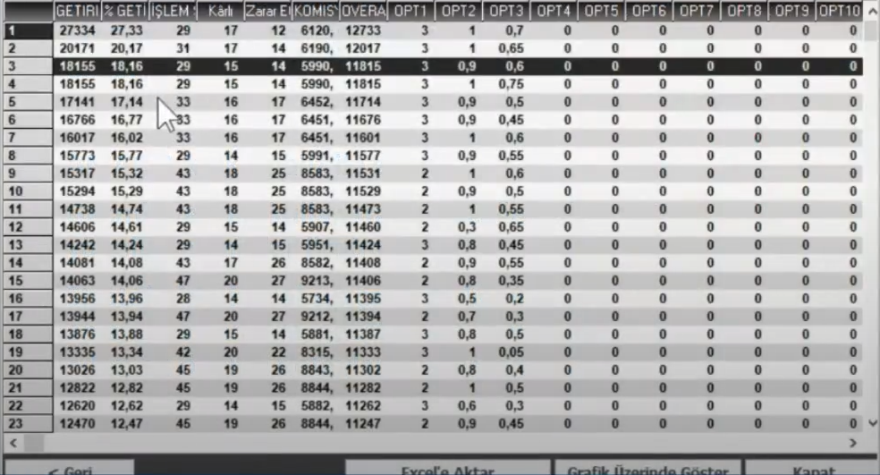
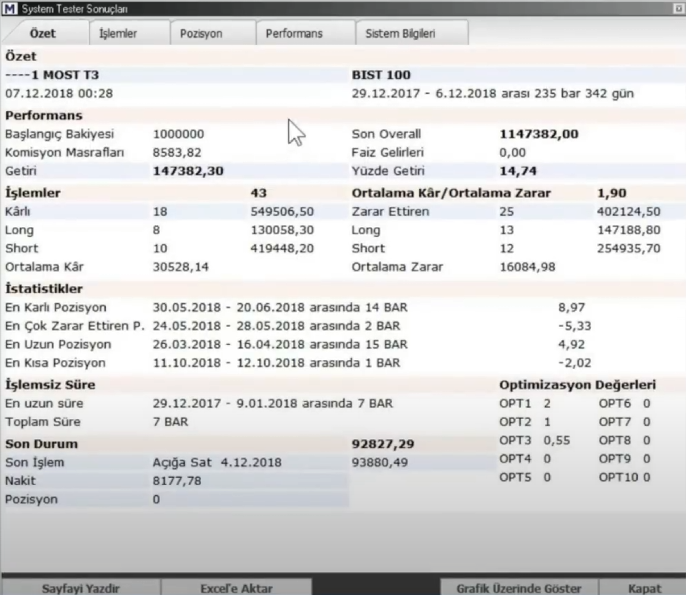
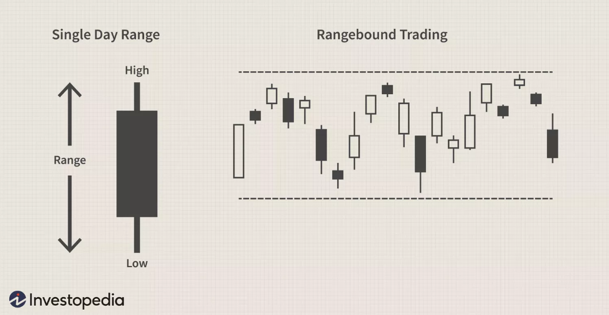
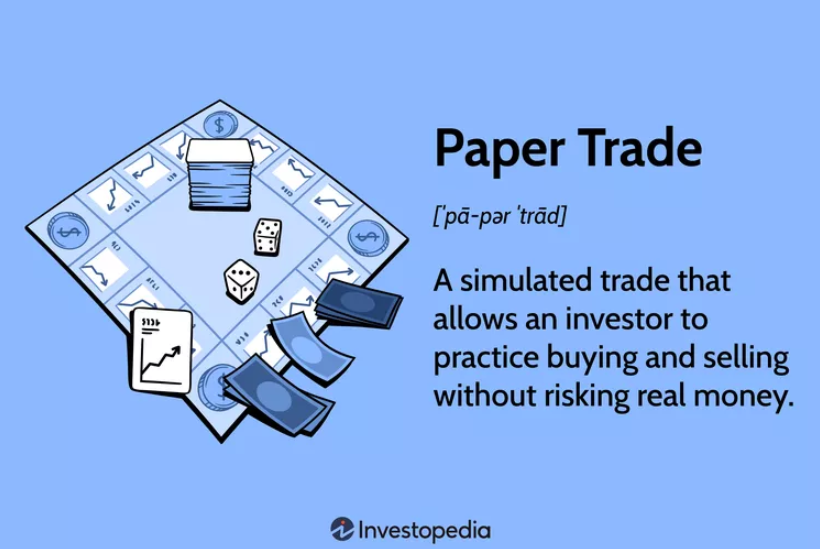
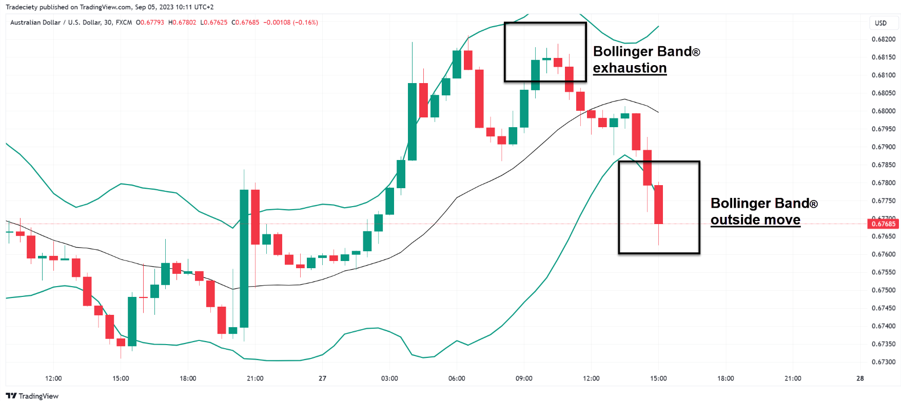
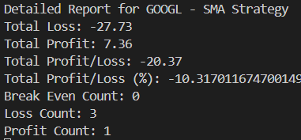
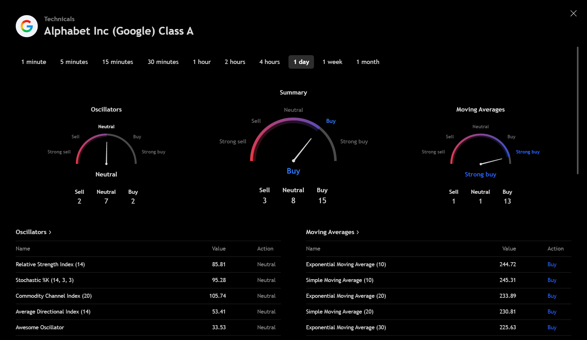
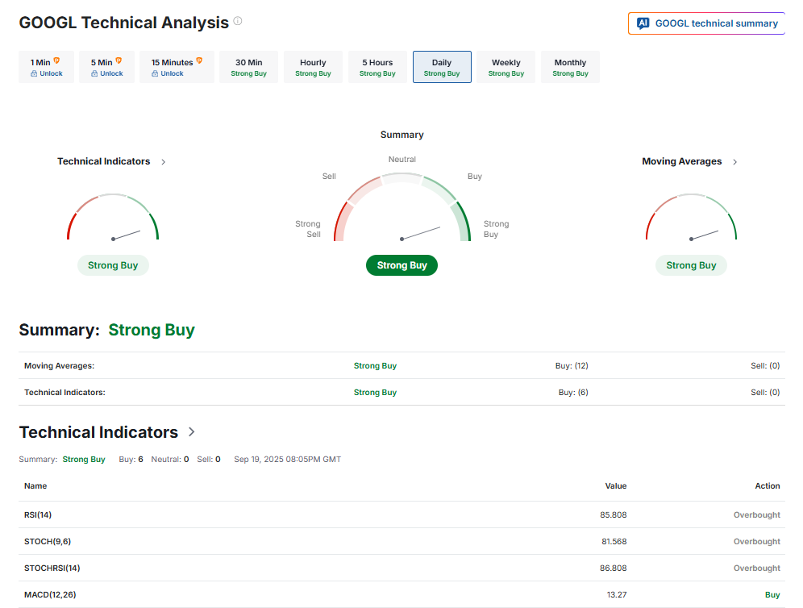
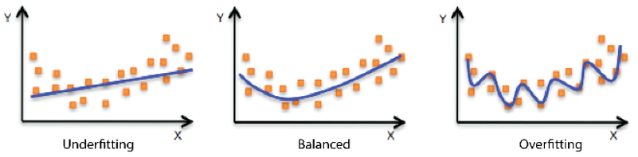

# Backtesting

Backtest, yani geriye dönük test, borsada işlem gören neredeyse tüm varlık türleri için yapılan analizlerin geçmiş fiyat verileriyle test edilerek kullanılan stratejinin metriklerini hesaplama yöntemine verilen addır.

Tarihsel verilerle geçmişe yönelik analizler yaparak bir stratejinin uygulanabilirliğini değerlendirir. [1]

Amaç teknik analiz ile aynıdır:
1. Geçmiş verileri kullanarak geleceğe yönelik tahminler üretmek
2. Stratejinizin iyi çalışıp çalışmadığını anlamak
3. Stratejinizi geliştirmeye yardım etmek

> Backtest, bir trader'ın, herhangi bir sermayeyi riske atmadan önce potansiyel risk ve karlılığı analiz etmek için kullanılan tarihsel verileri analiz etmektedir.

Yüzde getiri, ortalama kar, kaç işlem yapıldı (hacim), kaç işlem karla/zararla kapandı gibi metrikler ölçülür. Genellikle yüzde getiri dikkate alınır.

> Backtest, piyasada herhangi bir enstrümanla işlem yapmadan önce yapılması gereken çok kritik bir adımdır. Backtestsiz işleme girilen tüm stratejiler "gözü kapalı" bir şekilde riske atılmayı temsil eder.

## Backtest'in yararları

* Olumlu sonuçlar veren ve iyi yönetilen bir backtest, yatırımcıya stratejisinin temelde sağlam olduğu ve gerçekte uygulandığında kar elde edebileceği konusunda güvence sağlar.

* Ayrıca iyi yönetilen bir backtest, istenilen sonuca ulaşılamadığı takdirde yatırımcının stratejiyi değiştirmesinin veya ilgili sistemi uygulamayı reddetmesinin önünü açar ve muhtemelen bir zararı daha başlamadan önlemiş olur.

* Robot olarak geliştirilen otomatik sistemlerde, algoritmaların geliştirilmesinde **en önemli** adımdır.

> **Potansiyel Limitasyon**
Backtest, geçmişe yönelik fiyat verileriyle yapıldığından ötürü geçmiş fiyat verileriyle çok iyi uyuşan bir strateji bulursak bile, fiyatın gelecek hareketlerinde aynı performansı göstermeyebilir. Bunun nedeni stratejinin geçmiş fiyatları overfit etmesinden (yani geçmiş fiyatlara aşırı uyum sağlamasıdan) kaynaklanmaktadır. 

### MatriksIQ Backtest Ekranı





## Terminoloji

* Strateji: Belirli kurallar ve yöntemlerle alım-satım kararlarını yöneten yatırım planı. Yatırımcılar kendi stratejilerini oluşturarak kullanmak istedikleri piyasa üzerinde backtest yaparak stratejilerini geçmişe yönelik test edip, güvenilirliğini ölçerler.

* Trading Capital: Alım-satım işlemlerini yapmak için ayrılan sermayeye denir. Kullanılabilir nakit veya marjin.

* Enter/Exit Points: Bir pozisyona giriş ve çıkış fiyat seviyeleri; nereden alıp satılacağını belirler.

* Pozisyon: bir yatırımcının bir finansal varlıkta sahip olduğu açık işlemi ifade eder—bu işlem bir alış (Long) veya satış (Short) şeklinde olabilir. Her işlem, bir pozisyon açılmasıyla başlar ve bu, riskin, kârlılığın ve sermaye yönetiminin belirlenmesinde önemli bir rol oynar. [3]
    * Long pozisyon: Hisseyi düşükten alıp fiyatın yükselmesinden kazanç sağlamak.
    * Short pozisyon: Hisseyi yüksekten ödünç alıp, fiyat düşüşünde satarak kazanç sağlamak. Açığa satış (short selling) olarak da bilinir.

* Take-profit (Kar Realizasyonu): Pozisyon hedef fiyatına ulaştığında kazancın fiilen realize edilmesi, karı güvence altına almak için kullanılır.

* Stop-loss: Pozisyon belirlenen zarar seviyesine ulaştığında otomatik kapanan emir, sermâyeyi korur.
    * Trailing stop: Pozisyon fiyatına göre dinamik olarak hareket eden stop-loss, zararı sınırlamak ve karı korumak için kullanılır.

* Lot/Share
    * Share, bir şirketin sahipliğini temsil eden tek bir hisse senedi birimi. 
    * Lot, genellikle borsada işlemlerin standart birim olarak gruplanması için kullanılır. Bazı piyasalarda hisse alım-satımı minimum lot (örneğin 100 hisse) üzerinden yapılır.

* Emir (Order): Borsada alım veya satım yapmak için verilen talimattır. Yani bireysel yatırımcıların, bir menkul varlığı mevcut fiyattan satın alması veya satması için broker'ına (aracı) ilettiği komuttur.
    * Alım Emri (Buy Order): Belirli bir hisse veya varlığı almak için verilen emir.
    * Satım Emri (Sell Order): Sahip olunan hisseyi veya varlığı satmak için verilen emir.
    * Emir Türleri:
        * Market Order (Piyasa Emri): Anında mevcut fiyat üzerinden alım/satım yapılır.
        * Limit Order (Limitli Emir): Belirli bir fiyat seviyesine ulaşınca alım/satım yapılır.
            * Buy limit: Yatırımcı, belirli bir fiyattan veya daha düşükten almak ister. **Bid** fiyatına bağlıdır.
            * Sell Limit: Yatırımcı, belirli bir fiyattan veya daha yükseğe satmak ister. **Ask** fiyatına bağlıdır.
        * Stop Order (Stop Emri): Fiyat belirli seviyeye gelince tetiklenen emir.
            * Stop loss
            * Take profit

* Bid ve Ask
    * Bid (Alış Fiyatı): Alıcıların bir menkul varlık için ödemeye razı olduğu **maksimum** fiyat. Genellikle buy limit order’larla oluşur.
    * Ask (Satış Fiyatı): Satıcıların menkul varlığı satmaya razı olduğu **minimum** fiyat. Genellikle sell limit order’larla oluşur.
    * Spread: Bid ve ask arasındaki farktır; piyasa likiditesi ve işlem maliyetini gösterir.
        * Inside spread: En yüksek bid ve en düşük ask arasındaki farka denir.

* Trading range: Menkul varlığın belirli high ve low seviyeler arasında tutarlı bir şekilde hareket etmesi durumuna denir. Genellikle trading range'in üst seviyesi direnci temsil ederken, alt seviyesi desteği temsil eder.

    

* Paper Trade: Trading platformları yaygınlaşmadan önce traderların gerçek sermaye kullanmadan, kağıt üzerinde trading yaparak gerekli temel noktaları öğrenmesi için yaptığı öğrenme türüdür. Trader tüm pozisyon, portfolyo ve kar/zararlarını not ederek stratejisini takip eder. Bir tür kağıt üzerinde trading simülasyonudur.
    * Yeni oluşturulan bir stratejiyi uygulamadan önce test etme fırsatı sağlar.
    * Yeni başlayanlara platform hakimiyeti ve trading incelikleri sağlar.
    * Gerçek pazar koşullarındaki duyguları yansıtmayabilir.

     [5]

* Slippage (Fiyat kayması): Verdilen emir ile emir gerçekleştiğinde oluşan fiyat farkıdır. Yani, istenilen fiyattan işlem olmayıp, biraz daha yüksek veya düşük fiyattan işlem gerçekleşmesi durumudur. Piyasanın hızlı hareket etmesi, düşük likidite gibi nedenlerden kaynaklanır.

* Likidite: Bir varlığın piyasada kolayca alınıp satılabilme derecesidir. 
    * Yüksek Likidite = Varlık kolayca alınıp satılabilir ve fiyat değişimi çok küçük olur.
        * Örneğin BİST'teki büyük şirket hisselerinin (ASELS, ISCTR) istenilen miktarda hızlıca alınıp satılabilmesi gibi.
    * Düşük Likidite = Varlık zor satılır veya alıcı bulmak zaman alır. Fiyatlarda büyük dalgalanmalar olabilir.
        * Örneğin çok az işlem gören küçük şirket hisseleri veya bazı kripto paralar.

* Volatilite: Fiyatların belirli bir dönemde ne kadar hızlı ve büyük değiştiğidir. Yüksek volatilite, risk ve fırsat yüksek anlamına gelir.

     [4]

* Hacim: Belirli bir zaman diliminde alınıp satılan toplam varlık miktarı; piyasanın işlem yoğunluğunu gösterir.

* Benchmark: Performans ölçümü için referans değer. Örneğin, yıl sonunda %5 getiri elde edilmiş olabilir; ancak eğer döviz bazında bakarsak, dolar düşmüşse gerçek kazanç negatif olabilir.

* Tek/Çift Yönlü İşlem: Tek yönlü işlem, yatırımcının yalnızca bir yönde pozisyon aldığı (ör. sadece alım) stratejiyi ifade eder. Çift yönlü işlem ise hem alım hem satım pozisyonlarıyla piyasanın her iki yönünden de kazanç sağlamaya yönelik stratejidir.

# Strateji

Bu kısımda trading dünyasının en önemli kavramlarından biri olan **Strateji** kavramı ele alınacaktır. Strateji sözlük anlamı olarak çok kapsamlı bir kelimedir, ancak biz trading dünyasındaki yatırım stratejisinden bahsediyor olacağız.

## Strateji Nedir

Strateji, veya yatırım stratejisi, yatırım performansının maksimize edilmesi ve risklerin yönetilmesi amacıyla risk iştahı, yatırımcı profili, finansal beklentiler ve zaman ufku başta olmak üzere çeşitli faktörle dayalı olarak sermayenin farklı finansal araçlara tahsisi için planlanan yol haritasıdır. Teknik analiz stratejisi ise, yatırımcının bir trade'e girmeden önce o işleme "girmeli mi yoksa girmemeli mi" üzerine belirlediği kurallar çerçevesidir. Eğer yatırımcı, stratejisinin pozisyona giriş ve pozisyondan çıkış kuralları yatırım yapmak istediği piyasa ile örtüştüğünü fark ederse broker'ına bu yönde emirde bulunabilir.

Bir trader'ın amacı sürekli kar elde etmek değildir, bu neredeyse imkansızdır. Uzman trader'ların bile kayıp ile sonuçlanan işlemleri kazanç ile sonuçlanan işlemlerinden daha fazla olabilir, ancak bu kayıp ve kazanç hacimleri arasında büyük bir fark vardır. Bir yatırım stratejisinin amacı *sadece kar elde etmek* yerine *zarardan çok kar elde etmek* olmalıdır, zira yatırım dünyası kazancıyla ve kaybıyla var olmaktadır.

Yatırım stratejisi çeşitli parametreler barındırır. Yukarıda da bahsedildiği üzere yatırımcının uzun mu kısa mı pozisyon açmak istediği, finansal beklentileri, risk iştahı, işlem yapmak istediği borsa türü, backtest stratejisi ve kar zarar oranı beklentisi gibi ve daha envai çeşit parametre bulunmaktadır.

Bir de mekanik sistemler vardır. Mekanik sistemler, kullanıcıların kendi indikatörlerini seçip, stratejilerini oluşturarak, backtestlerini yaparak, backtest raporlarını alıp canlı bir şekilde piyasayı takip ederek kendi yöntemlerini dijital bir algoritma ile oluşturmakta ve bu sistemin gönderdiği Al/Sat/Tut sinyallerini broker'ına emir olarak göndermektedir.

### Yatırım Stratejilerinin Olmazsa Olmazları:

1. İlkeleri olmalı: İlkeler, stratejinin sahip olması gereken ana çerçevedir.
    * Uygulanabilirlik: Hedef amaç ve ulaşılmak istenen sonuç anlamlı olmalı.
    * Ölçülebilirlik: Hedef ölçülebilir olmazsa, stratejinin amaca ulaşıp ulaşmadığını anlayamayız.
    * Belirlilik: Gerçekçi bir zaman diliminde mantıklı bir sonuç belirlenmesi gereklidir.

2. Trade edilebilir olmalı: Strateji, işlem yapılabilir olmalı.
    * Düzenli kar edebilen (toplam ve uzun vadede)
    * Zor koşullara dayanıklı olmalı
    * Uygun Risk/Ödül oranı belirlenmiş olmalı
    * Trade alışkanlıklarına ters düşmemeli: Sık işlem yapan birinin stratejisi sık işlem yapmıyorsa bu yapı trader'a ters düşer.
    * Bilimsel yöntemlerle testlerden geçmiş olmalı
    * Katlanılabilecek geri çekilme miktarını (drawdown) aşmamalı

3. Özgün olmalı: Herkesin kullandığı stratejiler de kullanılabilir, hatta kar da elde edilebilir. Ancak aynı stratejiyi bilen ve kullanan kişi sayısı arttıkça, elde edilen getiri aynı miktarda azalacaktır.
    * Özgün bir fikir olmalı
    * Alfa yaratan olmalı
    * Gizli / münhasır olmalı: Kar eden strateji gizlenir, ve gizlenmelidir de
    * Yatırımcıya uygun olmalı
    * Matematiksel olmalı

## Ana Strateji Türleri

Bu kısımda algoritmik trade için en uygun olan 5 ana strateji türünden bahsedilecektir.

### 1. Momentum Stratejileri

**Momentum**, güç ölçümünü değişimden alır ve değişim hesaplanırken **fark** dikkate alınır. Momentum mantığında iki durum/nokta/fiyat arasındaki fark yatar.  

### 2. Trend Takip Stratejileri

**Trend takip stratejileri**, fiyatın belirli bir yönde hareket ettiği dönemleri belirleyip bu yön doğrultusunda pozisyon almayı amaçlar. Yatırımcılar, yükselen trendlerde alım, düşen trendlerde ise satım yaparak trendin devamından kazanç sağlamayı hedefler.  

### 3. Ortalamaya Dönüş (Mean Reversion)

**Ortalamaya dönüş stratejileri**, fiyatın zamanla kendi ortalamasına dönme eğiliminden faydalanır. Fiyat ortalamanın çok üzerine çıktığında satış, çok altına düştüğünde alım yapılır; böylece aşırı fiyat hareketlerinden kazanç sağlanması amaçlanır.  

### 4. Price Action Stratejileri

Fiyat hareketlerini doğrudan analiz eden stratejilerdir. **Formasyon ve kırılımlar**, trend değişimleri, **mum formasyonları**, seviye kırılımları, inside/outside barlar ve fiyat boşlukları takip edilerek; fiyatın tepe yaptığı yerden satıp dip yaptığı yerden alma mantığıyla uygulanır. Yatırımcılar tarafından dikkatlice takip edilen ve doğrudan piyasa fiyatına dayanan bir strateji türüdür.  

### 5. Arbitraj Stratejileri

Piyasalarda bir malı ucuza alıp pahalıya satmak anlamında kullanılır. Türev piyasalarda genellikle arbitraj, vadeli ve spot fiyatlar arasındaki farkları kullanarak yapılan *pairs trading* yani ikili işlemleri ifade eder. Bunun için teorik fiyat ve vadeli fiyat kıyaslamaları yapılır.

> Hacim stratejilerinin bu listede olmama nedeni hacim bilgisinin tek başına işlem yapılmasını sağlayacak kadar anlamlı bir bilgi taşımıyor olmasından kaynaklıdır. Mutlaka başka tetikleyici mekanizmalarla desteklenmesi gereklidir. Sadece hacim kullanmak yerine, ana bir mekanizmanın yan rolü olarak hacim, onaylayıcı olarak kullanılabilir. 

### İşlem Frekanslarına Göre Stratejiler

| Strateji Adı | İşlem Süresi | İşlem Aralıkları | Kullanılan Araçlar / Notlar |
|------------------------|------------------|-----------------------|----------------------------------------------------|
| **Scalping**           | Çok kısa vadeli  | Saniyeler / Dakikalar | Genellikle indikatörler; tüm olay hızlıdır        |
| **Day Trading**        | Gün içi          | Dakikalar / Saatler   | Price Action ve indikatörler; risk/ödül ~1       |
| **Overnight Trading**  | Gece             | Açılış-kapanış        | Gece alıp açılışa kadar satma; mesai dışı işlemler|
| **Swing Trading**      | Orta / kısa vadeli | Günler / Haftalar    | Teknik ve Temel Analiz; part-time trader          |
| **Position Trading**   | Orta / uzun vadeli | Günler / Haftalar    | Trend takibi; Stop Loss önemli                    |
| **Buy and Hold**       | Uzun vadeli      | Haftalar / Aylar      | Temel Analiz verileri; değer yatırımı             |


### Strateji (Sistem) Bileşenleri

1. **Piyasa Seçimi:** Ne alınıp ne satılacak? (Varlık türü, varlığın volatilite ve likidite seviyesi vb.)
2. **Pozisyon Büyüklüğü:** Ne kadar miktarda alınıp satılacak?
3. **İşleme Giriş:** Ne zaman alınıp satılacak?
4. **Stoplar:** Kaybeden bir pozisyondan ne zaman çıkılacak?
5. **İşlemden Çıkış:** Kazanan bir pozisyondan ne zaman çıkılacak?
6. **Taktikler:** Nasıl alınıp satılacak?
7. **Zaman Aralığı:** Hangi grafik periyodunda işlem açılacak?

### Strateji Tasarım Adımları

1. Stratejinin Kurallarını Belirleme & Algoritma Oluşturma
2. Stratejiyi Formüle Dökme
3. Ön Eleme - Backtest
4. Optimizasyon: Strateji test edilir, geçmiş veriler kullanılır, farklı parametreler denenir, yüksek getiri sağlayan ayarlar bulunur. Stratejinin, farklı karakterlere sahip enstrümanlarda da kullanılabişmesini sağlar. Çünkü her grafik birbirinin aynı karakterinde değildir.
5. Walk Forward Analizi: Dünya çapında kabul görmüş en etkili optimizasyon yöntemidir. Optimizasyonların en önemli problemi ıkan Overfitting/Curve Fitting sorunlarının en güvenilir çözümü olarak kabul edilir. Canlı piyasaya en yakın sonuçları verir ve gerçek piyada öncesi geçilmesi gereken en önemli engeldir. 
6. Monte Carlo Simülasyonu
7. Gerçek Zamanlı İşlemler
8. Sistemi İyileştirme

> Monte Carlo Simülasyonu: Monte Carlo Analizi, standart bir backtest raporunun sağlayabileceğinin ötesinde bir trade stratejisinin performansını daha doğru bir şekilde görülmesini sağlayan bir süreçtir.
> - Backtest raporları, belirli bir dizilişteki işlem serisinin sonuçlarını gösterir. Ancak bu sıralı diziliş, art arda yaşanan zararlı işlemlerin *Monte Carlo Yanılgısı* olayındaki gibi bir araya gelme ihtimalini göz ardı eder.

- *Monte Carlo Yanılgısı (Gambler's Fallacy):* Kumarbaz yanılgısı olarak da bilinen, rastgele ve birbirinden bağımsız olaylarda, geçmiş sonuçların gelecekteki olasılıkları değiştirdiğine inanma hatasıdır. Geçmiş gözlemler koşullu olasılığı değiştirmez. => P(A|geçmiş) = P(A)
    - Kumarbaz yanılgısı olarak bilinme nedeni, peş peşe 5 kere kırmızı gelen kartın, artık çok kırmızı geldiğinden dolayı sırada siyah geleceğinin düşünülmesindendir. Halbuki her spin bağımsızdır, olasılık aynı kalır.
    - Finans jargonunda: “Piyasa bu kadar düştü, artık yükselmesi lazım” veya “uzun süredir yükseliyor, kesin düşer” gibi düşünceler — aslında sadece psikolojik bias, istatistiksel gerçeklik değil.

### Örnek Strateji: SMA50 > SMA200

Günlük fiyat verilerini kullanarak, alım ve satım sinyalleri üreten basit bir strateji örneği üzerinden gidelim. Hareketli ortalamaların temel türü olan Basit Hareketli Ortalamaları (SMA) kullanarak, bir **hareketli ortalamalar kesişimi (Moving Averages Crossover)** stratejisi oluşturabiliriz. 

#### Strateji Mantığı

- **SMA50 (kısa vadeli SMA):** Son 50 günün fiyat ortalamasını temsil eder ve kısa vadeli fiyat hareketlerini gösterir.  
- **SMA200 (uzun vadeli SMA):** Son 200 günün fiyat ortalamasını temsil eder ve uzun vadeli trendi gösterir.  
- **Sinyal Üretimi:**  
  - Kısa vadeli SMA, uzun vadeli SMA’yı yukarı keserse → **Al sinyali**  
  - Kısa vadeli SMA, uzun vadeli SMA’yı aşağı keserse → **Sat sinyali**

| SMA Kısa > SMA Uzun | Sinyal |
|--------------------|--------|
| Evet               | Al     |
| Hayır              | Sat    |

#### Strateji Parametreleri

```pseudo
StrategyName: SMA50_SMA200_Crossover
TimeInterval: 1d            # Günlük kapanış fiyatlarını baz alır
Symbol: BIST100             # Örnek olarak bir endeks
EntryRule: SMA50 > SMA200
ExitRule: SMA50 < SMA200
StopLoss: 0.02              # Pozisyon açıldıktan sonra %2 düşüşte otomatik satış
TakeProfit: 0.04            # Pozisyon açıldıktan sonra %4 yükselişte otomatik satış
isTrailingStopLoss: true    # StopLoss fiyatla birlikte yukarı hareket edebilir
```

#### Strateji Açıklaması

- 50 ve 200 günlük SMA’lar kullanılarak trend takibi yapılır.
- Strateji, kısa vadeli trendin uzun vadeli trendi kesmesiyle al/sat sinyali üretir.
- StopLoss ve TakeProfit alanları, yatırımcının risk toleransına göre belirlenmiştir:
  - **StopLoss %2:** Pozisyon açıldıktan sonra fiyat %2 düşerse otomatik satış yapılır ve kayıp sınırlandırılır.
  - **TakeProfit %4:** Pozisyon açıldıktan sonra fiyat %4 yükselirse kar realize edilir.
  - **isTrailingStopLoss:** Fiyat yükselirken StopLoss seviyesi de yukarı kaydırılarak kar korunabilir.
- 1 günlük zaman aralığı, her barın bir günün fiyat hareketini temsil etmesini sağlar.

Kurallar tanımlandıktan sonra, bu stratejiyi geçmiş fiyat verileri üzerinde test ederek doğruluk ve risk metriklerini değerlendireceğimiz **backtesting** aşamasına geçebiliriz.

#### Strateji Backtest'i

Backtesting, stratejinin tarihsel fiyat verileri üzerinde nasıl performans gösterdiğini ölçmek için uygulanır. Bu aşamada:

1. Tarih aralığı ve sembol seçilir (örn. BIST100, son 1 yıl).
2. Her gün için SMA50 ve SMA200 hesaplanır ve Entry/Exit kuralları uygulanır.
3. StopLoss ve TakeProfit seviyeleri göz önünde bulundurularak pozisyonlar simüle edilir.
4. Elde edilen sonuçlar üzerinden:
   - Toplam getiri
   - Maksimum düşüş (Max Drawdown)
   - Win/Loss oranı
   - Risk/Reward oranı  

   gibi performans metrikleri hesaplanır.

Bu yöntemle stratejinin tarihsel doğruluğu ve potansiyel riskleri önceden gözlemleyebiliriz.

# TradeBot'ta Backtesting

Kullanıcı, TradeBot bünyesinde bulunan stratejilerin başarısını ölçmek adına geriye yönelik testler yapabilecektir. Kendisinin stratejisine uygun olduğunu düşündüğü indikatör ve indikatör parametrelerini rapor olarak indirebilir, yeni bir strateji oluşturup bu stratejiye tek başına veya birden fazla indikatörle birlikte kaydedebilir.

### Genel Akış

1. **Strateji ve Parametre Seçimi**  
   - Kullanıcı, test etmek istediği stratejiyi ve indikatörleri seçer.  
   - Strateji parametreleri (örn. SMA periyotları, RSI limitleri) belirlenir.

2. **Tarih Aralığı ve Sembol Belirleme**  
   - Hangi tarih aralığında test yapılacağı seçilir. (lookback parametresi ile)
   - Test edilecek sembol veya portföy belirlenir (örn. BIST100, GARAN).

3. **Geçmiş Fiyat Verilerinin Yüklenmesi**  
   - Seçilen sembol ve tarih aralığına ait OHLCV verileri indirilir.  
   - Eksik veri varsa işlenir veya uygun şekilde tamamlanır.

4. **Günlük Simülasyon Döngüsü**  
   - Her gün için indikatör değerleri hesaplanır.  
   - Stratejiye göre Entry/Exit sinyalleri üretilir.  
   - StopLoss ve TakeProfit kuralları uygulanır.  
   - Portföy durumu güncellenir, işlemler kaydedilir.

5. **Performans Analizi**  
   - Toplam getiri, maksimum düşüş (Max Drawdown), Win/Loss oranı gibi metrikler hesaplanır.  
   - Risk/Reward oranı, Sharpe oranı gibi ek göstergeler oluşturulur.

6. **Raporlama ve Görselleştirme**  
   - Rapor hazırlanarak veritabanında backtest tablosuna kaydedilir.  
   - İşlem logları kullanıcıya sunulur.


### Örnek Senaryo

- Kullanıcı, SMA50/SMA200 stratejisini BIST100 üzerinde test etmek istiyor.  
- Tarih aralığı: 01-01-2025 – 01-09-2025  
- Backtesting sırasında:
  1. Her gün için SMA50 ve SMA200 hesaplanır.  
  2. SMA50 > SMA200 → Al sinyali, SMA50 < SMA200 → Sat sinyali üretilir.  
  3. StopLoss %2 ve TakeProfit %4 uygulanır.  
  4. Tüm işlemler simüle edilir ve portföy değeri güncellenir.  
- Test tamamlandığında, toplam getiri, maksimum düşüş, kazan/kaybet oranı ve risk/kar metrikleri raporlanır.

## TradeBot Backtest İmplementasyonu

TradeBot ta4j kütüphanesinin sağlamış olduğu backtesting sınıflarından yararlanarak stratejilerini ölçmektedir. Uygulama kapsamında tüm indikatörlerin varsayılan değerleri ile kaydedilmiş basit indikatör bazlı stratejiler bulunmaktadır. Özelleştirilmiş strateji eklemesi güncel aşamada manuel olarak yapılmaktadır. Plan, en optimize çalışan stratejiyi bularak gerçek hayat uygulamasına geçirmektir.

### TradeBot'ta SMA50>SMA200 Stratejisinin Backtest Çıktıları

```json
{
  "symbol": "GOOGL",
  "strategyName": "SMA Strategy",
  "lookbackPeriod": 252,
  "currentSignal": "NEUTRAL",
  "score": 0,
  "lastDecisionValue": 0,
  "lastDecisionValueDescriptor": "HOLD",
  "totalProfit": 7.36,
  "totalLoss": -27.73,
  "totalProfitLossRatio": -20.37,
  "totalProfitLossRatioPercent": -10.317011674700149,
  "grossReturn": 0.8969914784775556,
  "averageProfit": 7.36,
  "breakEvenCount": 0,
  "lossCount": 3,
  "profitCount": 1,
  "returnOverMaxDrawdown": 4.1414705780184065,
  "rewardRiskRatio": 4.1414705780184065,
  "maximumDrawdown": 0.21658767376943297,
  "averageDrawdown": 0.032053596029553016,
  "numberOfTrades": 9,
  "numberOfPositions": 4,
  "averageHoldingPeriod": 25.75,
  "totalHoldingPeriod": 103,
  "winningPositionsRatio": 0.25,
  "losingPositionsRatio": 0.75,
  "winningTradesRatio": 0.25,
  "buyAndHoldReturn": 0.59389274763782,
  "versusBuyAndHold": 0.3030987308397356,
  "cashFlow": 1.276006195676326,
  "profitLoss": 0.276006195676326,
  "sharpeRatio": 1.1067939267195037,
  "sortinoRatio": 1.1288559378617478
}
```

ve

 şeklindedir.


Strateji testleri input olarak yukarıdaki strateji parametrelerini almalıdır ancak geliştirme aşamasında olunan TradeBot şu an için yalnızca sembol, indikatör parametreleri, lookbackPeriod ve fiyat türü (varsayılan olarak kapanış fiyatları) almaktadır. Tüm stratejiler base bir çıktı vermektedir. Amaç, Investing.com ve TradingView platformlarının sağlamış olduğu multiindicator bazlı karar matrisi servisini oluşturmaktır.

#### TradingView Technical Metrics



#### Investing.com Teknik Metrikler



#### TradeBot Teknik Metrikler

```json
{
  "symbol": "GOOGL",
  "date": "2025-09-22T02:03:43.307105400Z",
  "signal": {
    "EMA200": [
      "NEUTRAL",
      0.6666666666666666
    ],
    "DMI": [
      "NEUTRAL",
      0.5
    ],
    "MFI": [
      "SELL",
      1
    ],
    "TrendlineBreakout": [
      "SELL",
      0.5542168674698795
    ],
    "BollingerBands": [
      "NEUTRAL",
      0
    ],
    "EMA_Crossover": [
      "NEUTRAL",
      0.5
    ],
    "EMA50": [
      "NEUTRAL",
      0.75
    ],
    "MACD": [
      "NEUTRAL",
      0.6363636363636364
    ],
    "SMA200": [
      "NEUTRAL",
      0.5555555555555556
    ],
    "SMA50": [
      "NEUTRAL",
      0.5
    ],
    "RSI": [
      "SELL",
      0.5
    ],
    "SMA_Crossover": [
      "NEUTRAL",
      0.25
    ]
  },
  "signalCounts": {
    "SELL": 3,
    "BUY": 0,
    "NEUTRAL": 9
  },
  "overallDecision": "SELL"
}
```

Yukarıdaki GOOGL örneği üzerinde de görüldüğü üzere, platformların kullandıkları stratejiler piyasaya göre değişkenlik gösterip, temel analiz ve haber analizi gibi çeşitli diğer etmenleri de içerdiğinden ötürü stratejilerinin göndermiş olduğu sinyaller TradeBot'tan büyük ölçüde değişkenlik göstermiştir. Bunun çözümü olarak, Walk Forward Optimizasyonuna (out-of-sample testing) giriş yapılacaktır. 

TradeBot üzerindeki karar matrisinin overall karar algoritmasında kullanılan, güven aralığını belirten metrik kar zarar oranı olarak kullanılmaktadır. Bu metrik ilerleyen aşamalarda parametre olarak alınacaktır. 

# Walk Forward Optimization

Optimizasyon: Kelime anlamı olarak en uygun veya en iyi duruma getirme anlamlarını taşır. Finansta ise optimizasyon, belirli bir hedefi en iyi şekilde yerine getirmek için en anlamlı çözümü en uygun parametre ayarlarını bulma sürecine verilen addır. Stratejinin performansını maksimize etmeyi hedefler. Ancak aşırı optimizasyondan da kaçınılmalıdır.

Walk forward optimizasyonu, bir yatırım stratejisinin optimal parametrelerini bulmak için finansta kullanılan bir metottur. İlk olarak 1992 yılında, Robert E. Pardo'nun *"Design, Testing and Optimization of Trading Systems"* kitabında ortaya çıkmıştır. Günümüzde halen yatırım sistemi doğrulamalarında "altın standart" olarak kullanılmaktadır. 

### **Doğru ve Anlamlı** Yapılan Optimizasyonlar:

1. Kar maksimizasyonu sağlar
2. Verimliliğin artırılmasını sağlar
3. Hızlı karar verebilmeyi sağlar
4. Riskin Azaltılmasına Katkıda Bulunur
5. Stratejinin Çalışan İdeal Ayarlarının bulunmasını sağlar
6. Veriye dayalı kararlar almayı sağlar
7. Deneme yanılma süresini azaltır
8. Bir stratejinin farklı karaktere sahip enstrümanlarda da kullanılabilmesini sağlar. Stratejiyi daha **esnek** hale getirir.

### Optimizasyon Riskleri

1. Overfitting ve Curve Fitting: Geçmiş veriye aşırı uyum sağlama
    * Overfitting: Modelin belirli bir veri kümesine aşırı uyum göstermesi ve bu veri kümesinde yer almayan yeni verilere uyum sağlayamaması problemidir. Genellikle eğitim verisinde çok yüksek performans, test verisinde düşük performans olarak kendini gösterir.
    * Curve fitting: Modelin veri setindeki tüm noktaları, rastgele gürültüleri bile öğrenerek eğriye tam olarak uydurmasıdır. Overfitting’in bir nedeni olabilir.

    

2. Geçmişe odaklanma: Sadece geçmiş veriye odaklanan modelin/stratejiinin başarılı olma ihtimali geçmiştekiyle aynı değildir.

3. Veri yetersizliği: Veri yetersizliği durumunda optimizasyon sonuçları güvenilirlik sağlamayabilir

4. Optimizasyon parametrelerinin yanlış seçimi

5. Optimize edilen parametre sayısı: Parametre sayısı arttıkça genel olarak sistem getirileri artar ve sistem aşırı uyumlanmış olur (overfit)

### Optimizasyon Tuzakları

1. **Survivorship Bias**: Hayatta kalma önyargısı, geçmişte başarısız olan şirketleri veya stratejileri veri setinden çıkarmak ve sadece başarılı olanları dikkate almak anlamına gelir. Bu, performansın olduğundan daha iyi görünmesine neden olur.

2. **Lookahead Bias**: İleriye bakma önyargısı, modelin geçmiş veriyi işlerken gelecekteki bilgileri kullanması durumudur. Örneğin, bir stratejiyi test ederken o günün kapanış fiyatını veya gelecekteki bir veriyi kullanmak hatalı sonuç verir.

3. **Data Snooping**: Veri ayıklama önyargısı, çok sayıda strateji veya parametreyi aynı veri üzerinde test ederek şans eseri iyi sonuçlar elde etmek ve bunu genellenebilir başarı gibi görmek demektir.

4. **Curve Fitting**: Aşırı optimizasyon, modelin geçmiş veriye o kadar iyi uyum sağlamasıdır ki, rastgele gürültüleri bile öğrenir. Bu durum genelleme kabiliyetini bozar ve yeni verilerde başarısız olma riskini artırır.

5. **İşlem Maliyetlerinin Göz Ardı Edilmesi**: Strateji testlerinde komisyon, spread ve slippage gibi gerçek maliyetler göz ardı edilirse, teorik kârlar gerçekte ulaşılabilir olmayabilir.

6. **Zaman Periyodu Önyargısı (Time Interval Bias)**: Sadece belirli bir zaman aralığı veya veri periyodu (ör. günlük, saatlik) kullanarak yapılan testler, farklı interval ve piyasa koşullarında stratejinin performansını yansıtmayabilir.

7. **Likidite Önyargısı**: Stratejinin varsayıldığı gibi tüm pozisyonları hemen ve tam olarak kapatabilmesi varsayımı, gerçek piyasalarda düşük likidite nedeniyle mümkün olmayabilir.

> **Dikkat edilmesi gerekenler**
> - Veri kalitesi
> - Parametrelerin sınırları ve kontrolü
> - Dayanıklılık testleri: Optimize edilmiş veya edilmemiş strateji piyasanın zorlu koşullarında test edilerek de doğrulanmalı
> - Gerçek zamanlı testler
> - İşlem maliyetleri ve kısıtları
> - Gerçekçi beklentiler

### TradeBot'ta Walk Forward Optimization


---

 > *"To be successful, you need to treat trading as a business and stocks as your business inventory. There will be losses, as much as there will be wins."* [2]

## Kaynakça

[1] Yatırım Finansman Youtube

[2] Trading for Dummies

[3] https://tradingfinder.com/tr/education/forex/what-is-trading-position/

[4] https://tradeciety.com/bollinger-bands-explained-step-by-step 

[5] https://www.investopedia.com/terms/p/papertrade.asp 

> Ana kaynak olarak: Youtube-Yatırım Finansman: *"Kıvanç Özbilgiç ile A’dan Z’ye Algoritmik İşlemler"* video serisinden yararlanılmıştır.