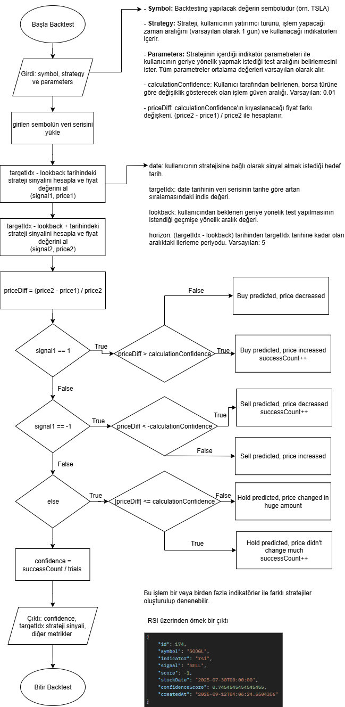

# Backtesting

Backtesting, borsada işlem gören neredeyse tüm varlık türleri için yapılan analizlerin geçmiş fiyat verileriyle test edilerek kullanılan stratejinin bazı metriklerini hesaplama yöntemine verilen addır.

Backtesingin birkaç çeşidi vardır.

## Nasıl uyguluyoruz?

